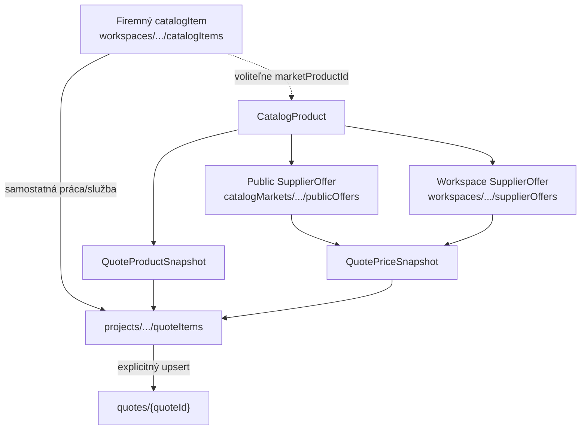

# Phase 2A — Slovak product catalog data contract

**Date:** 2026-07-20  
**Decision for Phase 2B (company price-list import):** **CONDITIONAL GO**  
**Scope:** Types, validation, matching, search tokens, path contract, optional quote snapshots.  
**Out of scope:** Catalog UI, CSV/XLSX import, scrapers, fake products/prices, PDF, assemblies, DPH engine, quoteItems migration, auto-seed.

## 1. Why product ≠ price

`CatalogProduct` is a technical identity (what the item *is*).  
`SupplierOffer` is a priced observation (who sells it, when, from which source, net/gross).  

Mixing them caused mock “market” prices and brittle AI sourcing. Quotes must freeze evidence via snapshots so later offer updates never rewrite historical lines.

## 2. Existing company catalogItems

**Path:** `workspaces/{workspaceKey}/catalogItems/{id}`  
**Service:** `src/services/materials/catalogItemsService.ts`  

Represents company-owned sell templates (work / product / custom).  
Insert into quote = **copy** name/unit/unitPrice — no live link.  
**Kept.** Optional Phase 2A refs only: `professionCode?`, `categoryId?`, `marketProductId?`, `preferredSupplierOfferId?`.

## 3. KEEP / EXTEND / ADAPT / DEPRECATE

| Module | Decision | Note |
|--------|----------|------|
| `catalogItems` + CSV company import | **KEEP** | Firm price list |
| `QuoteDraftItemDoc` / `quoteItems` | **EXTEND** | Optional `productSnapshot` / `priceSnapshot` |
| `countryConfig` / market profile | **EXTEND** | SK→EUR defaults reused |
| `productSourcingTypes` / connectors | **ADAPT** | Runtime AI helpers; not SoT |
| `mockSupplierConnector` | **REMOVE LATER** | Not wired into this contract |
| `supplierCatalogs` (rules, read-only) | **ADAPT** | Legacy knowledge; superseded conceptually by `catalogMarkets` |
| New `src/lib/catalog/**` | **CREATE** | Contract of record |

## 4–6. Professions, categories, CatalogProduct

- Professions: `src/lib/catalog/professions.ts` — deterministic in-code SK list, **not** auto-seeded at app start, no products/prices.
- Categories: `src/lib/catalog/categories.ts` — hierarchical data docs (not enums); tree validation; test fixtures only in tests.
- Product: `src/lib/catalog/types.ts` — no authoritative price fields; `packageQuantity > 0`.

## 7–9. Supplier + public / workspace offers

Shared `SupplierOfferBase`.  
Visibility:

| Kind | Path |
|------|------|
| Public | `catalogMarkets/{marketCode}/publicOffers/{offerId}` |
| Workspace | `workspaces/{workspaceKey}/supplierOffers/{offerId}` |

Also defined: professions, categories, products, suppliers under `catalogMarkets/{marketCode}/…`.

## 10. Firestore paths

```text
catalogMarkets/{marketCode}/professions/{professionCode}
catalogMarkets/{marketCode}/categories/{categoryId}
catalogMarkets/{marketCode}/products/{productId}
catalogMarkets/{marketCode}/suppliers/{supplierId}
catalogMarkets/{marketCode}/publicOffers/{offerId}

workspaces/{workspaceKey}/catalogItems/{catalogItemId}   # existing
workspaces/{workspaceKey}/supplierOffers/{offerId}       # new (contract)

projects/{projectId}/quoteItems/{itemId}                 # unchanged SoT
quotes/{quoteId}                                         # explicit upsert
```

Helpers: `src/lib/catalog/paths.ts`.

## 11. Permissions & multi-tenancy

- **Firestore rules:** not changed in 2A (no emulator harness). Unmatched paths remain **deny-by-default**.
- `MARKET_CATALOG_CLIENT_WRITE_ALLOWED = false` — import must be server-only later.
- Workspace offer isolation: `canWorkspaceReadOffer(a, b)` requires equal workspace keys (solo uid / org id).
- Company A cannot read company B offers by path design.

## 12–13. Matching & search tokens

- Priority: GTIN → brand+MPN → supplierId+SKU.  
- Name → `probable` only; `canAutoImportMatch` requires `exact`.  
- Search tokens: diacritics strip, tokenize, limited prefixes, dedupe (`searchTokens.ts`).

## 14–15. Quote snapshots

Optional on `QuoteDraftItemDoc`:

- `productSnapshot` — frozen identity  
- `priceSnapshot` — frozen purchase/sale evidence; line sell price remains `unitPrice`

Mappers: `quoteSnapshots.ts`. Historical items without snapshots stay readable. UI does **not** auto-write snapshots yet.

## 16. Provider adapter

`CatalogSourceAdapter` interface + `createCompanyCatalogItemsAdapter` (injected listFn) as proof. No fake online adapter in production.

## 17. Feature flag

`NEXT_PUBLIC_ENABLE_SK_PRODUCT_CATALOG` — opt-in (`=== "1"`), **default OFF**.  
`isSkProductCatalogEnabled()` in `src/lib/catalog/feature.ts`. No UI change in 2A.

## 18. Tests

`src/lib/catalog/catalog.contract.test.ts` (+ existing materials/quotes suites).

## 19. Rollback

1. Leave flag unset / not `1`.  
2. Optional snapshot fields unused → no data migration.  
3. Delete or ignore `src/lib/catalog/**` if abandoning contract (company `catalogItems` untouched).

## 20. Intentionally not implemented

CSV/XLSX import, market UI, scrapers, seed products/prices, DPH refactor, PDF, assemblies, quoteItems backfill, Firestore rules blocks, emulator rules tests.

## 21. Recommendation for Phase 2B

**CONDITIONAL GO** for company price-list import **if**:

1. Import writes only to `workspaces/{workspaceKey}/supplierOffers` (+ optional product link), never to public offers from the client.  
2. Server-only or admin-gated write path + Firestore rules + emulator tests.  
3. Exact match only for auto-link; probable matches need human confirm.  
4. No mock supplier connector in the import path.  
5. Quote snapshots still optional until insert-from-catalog UI (2C+).

## Mermaid


