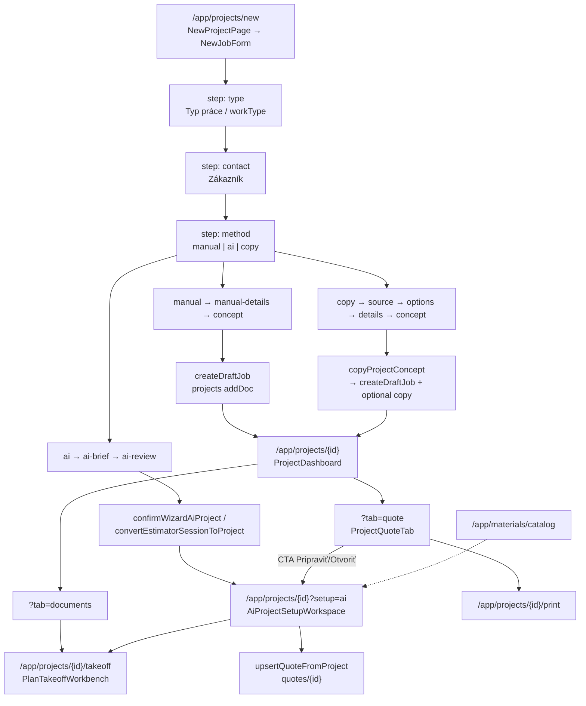

# Baseline: projekty, cenové ponuky, PDF takeoff, katalóg

**Dátum:** 2026-07-20  
**Repo:** `staveto-office` @ `a5bb632` (`master` = `origin/master`)  
**Git working tree:** clean (žiadne nesúvisiace lokálne zmeny)  
**Rozsah:** iba read-only overenie + tento dokument. **Žiadna zmena produkčného kódu.**

---

## 1. Executive summary

| Otázka | Overená odpoveď |
|--------|-----------------|
| Route novej zákazky | `/app/projects/new` → `NewProjectPage` → `NewJobForm` |
| Kedy vzniká `projectId` | Až pri submit (manual/copy: `createDraftJob`; AI: Cloud Function) |
| Landing po **manuálnom** vytvorení | `/app/projects/{projectId}` → `ProjectDashboard` |
| Existuje `/app/projects/{id}/quote`? | **Nie** (build routes to neobsahujú) |
| Manuálna editácia draft ponuky dnes | Tab `?tab=quote` → `ProjectQuoteTab` (súhrn); CTA ide na **`?setup=ai`** |
| Draft SoT ponuky | `projects/{projectId}/quoteItems` |
| Oficiálna ponuka | Top-level `quotes/{quoteId}` s embedded `items[]` |
| PDF takeoff | `/app/projects/{id}/takeoff` → `PlanTakeoffWorkbench` + `DrawingPdfViewer` |
| Firemný katalóg | `/app/materials/catalog` → `workspaces/{wsKey}/catalogItems` |
| Mock ceny | Áno — `createMockSupplierConnector` v product sourcing |
| AI predvolene | Wizard AI = ON (`NEXT_PUBLIC_DISABLE_AI_GENERATION !== "1"`) |
| Typecheck / build | **PASS** |
| Unit (quote/catalog/related) | **55/55 PASS** |
| E2E authenticated | **SKIP** (chýba `E2E_EMAIL` / `E2E_PASSWORD`) |

**Odporúčaný bezpečný fallback po novom create (Fáza 1):**  
`/app/projects/{projectId}?tab=quote` — existujúca route, bez novej paralelnej implementácie.  
Pozor: dnešný `ProjectQuoteTab` pri „Pripraviť ponuku“ stále odkazuje na `?setup=ai` — to je riziko Fázy 1/B, nie Fázy 0.

---

## 2. Aktuálny route diagram



---

## 3. Aktuálny dátový tok

### 3.1 Manuálne založenie

1. React state vo `NewJobForm` (žiadny Zustand; wizard nie je v URL okrem takeoff resume).
2. Submit `handleCreate` → `resolveCustomerFields` (môže `createCustomer` do `customers`).
3. `createDraftJob(activeWorkspace, uid, { workType, name, customer*, addressText, source: "web" })`.
4. `addDoc(collection(db, "projects"), …)` → `projectId`.
5. `router.push(`/app/projects/${projectId}`)`.

**Nevzniká** pri create: quote, fázy, úlohy, materiály, AI draft, `setup=ai`.

### 3.2 AI založenie

1. Generate draft (callable) → review.
2. Confirm → CF `createProjectFromDraft` / estimator convert → môže vytvoriť phases/tasks/materials/quoteItems.
3. Redirect `?setup=ai` → `AiProjectSetupWorkspace`.

### 3.3 Ponuka

| Fáza | Kde | Kto zapisuje |
|------|-----|--------------|
| Draft riadky | `projects/{id}/quoteItems` | AI setup sync, `DraftQuoteItemsPanel`, `lib/projects` CRUD |
| Meta (marža/DPH/work) | `projects.quoteDraftNotes` (+ `quoteDraftVatPercent`) | AI setup `persistMeta` / `updateDraftJobFields` |
| Publikovaná | `quotes/{id}` embedded `items` | `upsertQuoteFromProject` → `createQuote` / `updateQuote` |
| Spätný sync stavu | `projects.quoteStatus` / `lifecycleStatus` / `salesStatus` | `syncProjectFromQuote` |

---

## 4. Firestore cesty

| Entita | Path | Poznámka |
|--------|------|----------|
| Project / Job | `projects/{projectId}` | `phase`, `lifecycleStatus`, `salesStatus`, `quoteStatus`, `jobArchetype`, engine `workType`/`projectType` |
| Customer | `customers/{customerId}` | Workspace scoped |
| Draft quote lines | `projects/{id}/quoteItems/{itemId}` | **Draft SoT** |
| Official quote | `quotes/{quoteId}` | Embedded `items[]` (nie subcollection) |
| Documents | `projects/{id}/documents` | PDF pre takeoff |
| Takeoff quantities | `projects/{id}/takeoffItems` | + symbols/evidence/candidates |
| Phases / Tasks | `projects/{id}/phases`, `…/tasks` | AI confirm ich môže seednúť; manual create nie |
| Materials / suggestions | `projects/{id}/materials`, `materialSuggestions` | AI / setup |
| Company catalog | `workspaces/{wsKey}/catalogItems/{itemId}` | `wsKey` = uid alebo orgId |
| Estimator session | `estimatorSessions/{sessionId}` | AI |
| Org work types | `organizations/{orgId}.enabledWorkTypes` | Settings UI |

Solo vs company: `getProjectWorkspaceWriteFields` / `getWorkspaceStorageKey` — `ownerId`+personal vs `orgId`+team.

---

## 5. Komponentová mapa (overené)

| Kandidát | Existuje? | Skutočná cesta | Použitie |
|----------|-----------|----------------|----------|
| `NewProjectPage` | Áno | `src/app/(app)/app/projects/new/page.tsx` | Route entry; field users redirect |
| `NewJobForm` | Áno | `src/components/jobs/new/NewJobForm.tsx` | Celý wizard |
| `createDraftJob` | Áno | `src/services/projects/projectService.ts` | Manual/copy/onboarding/takeoff early draft |
| `copyProjectConcept` | Áno | `src/services/projects/copyProjectConcept.ts` | Copy vetva |
| `projectService` | Áno | `src/services/projects/projectService.ts` | Draft create/status/convert |
| `quoteItems` | Áno | `src/lib/quoteDraftItems.ts` + `lib/projects.ts` CRUD | Draft SoT |
| `quoteService` / `upsertQuoteFromProject` | Áno | `src/services/quotes/quoteService.ts` | Sync do `quotes` |
| `ProjectDashboard` | Áno | `src/components/projects/detail/ProjectDashboard.tsx` | Default detail po manual create |
| `DraftQuoteItemsPanel` | Áno | `src/components/jobs/DraftQuoteItemsPanel.tsx` | Line editor |
| `DraftJobWorkspace` | Áno, **orphan** | `src/components/jobs/DraftJobWorkspace.tsx` | **Žiadny import** mimo vlastného súboru |
| `AiProjectSetupWorkspace` | Áno | `src/components/projects/setup/AiProjectSetupWorkspace.tsx` | `?setup=ai` |
| `PlanTakeoffWorkbench` | Áno | `src/components/takeoff/PlanTakeoffWorkbench.tsx` | Canonical takeoff shell |
| `DrawingPdfViewer` | Áno | `src/components/takeoff/DrawingPdfViewer.tsx` | PDF renderer vo workbenchi |
| `catalogItems` | Áno | `src/services/materials/catalogItemsService.ts` | Firemný katalóg |
| `/app/projects/{id}/quote` | **Nie** | — | Neexistuje v App Router |

Ďalšie relevantné:

- `ProjectQuoteTab` — `src/components/projects/detail/ProjectQuoteTab.tsx` (CTA → `?setup=ai`)
- `AiCreationMethodStep` — výber AI/manual/copy
- `WorkTypeSettings` — `src/components/settings/WorkTypeSettings.tsx` na `/app/settings/company`
- `CatalogItemPickerDialog` — picker v AI setup materiáloch

---

## 6. Source of truth cenovej ponuky

1. **Draft:** `projects/{projectId}/quoteItems` (+ voliteľne meta v `quoteDraftNotes`).
2. **Publish/sync:** `upsertQuoteFromProject` → `resolveProjectQuoteLineItems` → `createQuote` / `updateQuote` na `quotes/{id}`.
3. **Linked draft na `/app/quotes/[id]`:** read-only ak `managedByProject` (edit cez projekt / AI setup).
4. **Takeoff → quote:** `takeoffQuoteMirror` zrkadlí potvrdené `takeoffItems` do draft riadkov v AI material stepe.

**Nevytvárať** druhú draft kolekciu ani local-only SoT v ďalších fázach.

---

## 7. PDF / takeoff model

| Vrstva | Symbol | Path |
|--------|--------|------|
| Page | takeoff route | `src/app/(app)/app/projects/[id]/takeoff/page.tsx` |
| Shell | `PlanTakeoffWorkbench` | `src/components/takeoff/PlanTakeoffWorkbench.tsx` |
| Viewer | `DrawingPdfViewer` | `src/components/takeoff/DrawingPdfViewer.tsx` |
| Quantities | `takeoffItems` | `src/services/takeoff/pdfTakeoffRegionService.ts` |
| Modes | `takeoffMode.ts` | quote-precheck / project / … |
| Embedded | AI material tab | `AiSetupMaterialStep` mountuje rovnaký workbench |

Značky/súradnice/strana: v takeoff dokumentoch a kandidátoch; množstvá v `takeoffItems` viazané na `drawingId`.

---

## 8. Katalógový model

### 8.1 Firemný katalóg (reálny)

- UI: `/app/materials/catalog`
- Service: `catalogItemsService` — kind `product` | `work`, **jedna predajná** `unitPrice` (nie oddelená nákupná / supplier offer).
- CSV: `catalogCsvImport.ts`
- Scope: `workspaces/{uid|orgId}/catalogItems`

### 8.2 Product sourcing (AI setup)

- Flag: `isProductSourcingEnabled()` — `NEXT_PUBLIC_ENABLE_PRODUCT_SOURCING` (prod default ON).
- Connectors: company catalog + pricebook + **`createMockSupplierConnector()` vždy** (`productSourcingService.ts`).
- Mock UI názov: „Mock Elektro Veľkoobchod“ — **nie reálny SK dodávateľ**.

### 8.3 Čo chýba voči cieľovému SK modelu

- Oddelený market product vs supplier offer
- Hierarchické profesie/kategórie ako seed (iba material categories helpers)
- Packaging / waste na quote line schema
- Snapshot nákupnej ceny na `quoteItems` (dnes len `unitPrice` sell)

---

## 9. AI závislosti a flagy

| Flag / helper | Predvolené | Účinok |
|---------------|------------|--------|
| `NEXT_PUBLIC_DISABLE_AI_GENERATION` | unset → AI **ON** | `isWizardAiGenerationEnabled()` |
| `NEXT_PUBLIC_FORCE_DISABLE_AI_FEATURES` | unset | Kill switch estimator family |
| `NEXT_PUBLIC_ENABLE_AI_ESTIMATOR_FLOW` | default ON | Estimator |
| `NEXT_PUBLIC_ENABLE_PRODUCT_SOURCING` | prod ON | Mock+catalog matching v AI setup |
| `?setup=ai` | — | Gate v `projects/[id]/page.tsx` → `AiProjectSetupWorkspace` |

Miesta s `setup=ai` (neúplný zoznam): `NewJobForm`, `ProjectQuoteTab`, `projectDashboard.ts`, `quotes/[id]/page.tsx`, print page, manager agent rules.

AI confirm **môže** automaticky vytvárať fázy/úlohy/materiály/quote items (CF) — v rozpore s budúcim SIMPLE BY DEFAULT.

---

## 10. workType / jobArchetype / lifecycle

### 10.1 Typy

- UI archetypes: `WorkType` v `src/lib/workTypes.ts` (`customer_job`, `large_construction_project`, `own_build`, …).
- Persist: `jobArchetype` + engine `projectType` (`BUILD`|`TRADE`) + engine `workType` (`REPAIR`|`NEW_BUILD`|…).
- `createDraftJob` **vyžaduje** `isWorkType(input.workType)` — bez typu create zlyhá.
- Settings: `WorkTypeSettings` na company settings; `enabledWorkTypes` na org.

### 10.2 Lifecycle (už existuje — nepridávať paralelný enum)

`ProjectLifecycleStatus` v `src/lib/projectLifecycle.ts`:

`new_request` → … → `quote_drafted` → `quote_sent` → `accepted` → `planned` / `in_progress` → `completed` / `archived`

`createDraftJob` nastavuje: `phase: "sales"`, `lifecycleStatus: "new_request"`, `salesStatus: "draft"`, `quoteStatus: "none"`.

`isDraftJob` = `normalizeProjectPhase === "sales"`.

---

## 11. Solo / organization scope

- Projects: `canCreateProject` / `canAccessProjectId` v `firestore.rules`.
- Quotes: `canCreateQuoteDoc` — org member alebo solo `ownerId`.
- Catalog: `workspaces/{workspaceId}/catalogItems` + `canAccessWorkspace`.
- Write stamp: `getProjectWorkspaceWriteFields` / `getActiveQuoteScope`.

---

## 12. Výsledky baseline testov (2026-07-20)

### Unit (relevantné)

```text
npm test -- src/lib/quotes src/services/materials/catalogItemsService.test.ts \
  src/lib/products/productSourcing.test.ts src/lib/enabledWorkTypes.test.ts \
  src/components/projects/setup/takeoffQuoteMirror.test.ts \
  src/lib/quotes/quoteWorkspaceScope.test.ts
```

**PASS** — 7 files, **55 tests**.

### Typecheck

```text
npm run typecheck
```

**PASS** (exit 0).

### Lint (kľúčové súbory)

```text
npx eslint src/components/jobs/new/NewJobForm.tsx \
  src/services/projects/projectService.ts \
  src/services/quotes/quoteService.ts \
  src/services/materials/catalogItemsService.ts \
  src/components/projects/setup/AiProjectSetupWorkspace.tsx \
  --max-warnings 0
```

**FAIL (pre-existing warnings, nie errors):**

| Súbor | Warning |
|-------|---------|
| `AiProjectSetupWorkspace.tsx:35` | `'defaultCalculation' is defined but never used` |
| `projectService.ts:109` | `'_userId' is defined but never used` |

### Production build

```text
npm run build
```

**PASS** — compiled successfully; warning o multiple lockfiles (`Staveto_Cursor/package-lock.json` vs office).

### E2E

```text
npm run test:e2e -- e2e/projects-new.spec.ts
```

| Test | Výsledok |
|------|----------|
| unauthenticated → login | **PASS** |
| authenticated manual/AI | **3 skipped** — chýba `E2E_EMAIL` / `E2E_PASSWORD` |

### Gaps (žiadne unit testy)

- `createDraftJob`
- `upsertQuoteFromProject` / `createQuoteFromProject`
- `NewJobForm` submit / duplicita

### Firestore rules emulator

V tejto baseline fáze **nespúšťané** (rules sa nemenili).

---

## 13. Najväčšie riziká pred Fázou 1

1. **Po manual create nie je editovateľný quote workspace** — `ProjectQuoteTab` tlačí do AI setup; `DraftJobWorkspace` je orphan.
2. **`createDraftJob` vyžaduje `workType`** — nový UI bez výberu typu musí nastaviť kompatibilnú legacy hodnotu (odporúčanie: `customer_job`), nie nový enum.
3. **AI je predvolene ON** v wizardi — treba centrálny flag OFF + nevolanie služieb (nie CSS hide).
4. **Mock supplier prices** v product sourcing — nesmú sa prezentovať ako firemná nákupná cena.
5. **Dvojitý draft editor** (orphan panel vs AI setup) — riziko driftu; Fáza B musí zvoliť jeden SoT UI nad `quoteItems`.
6. **E2E bez credentials** — authenticated regresiu wizardu zatiaľ nemožno overiť v CI lokálne.
7. **Orphan `DraftJobWorkspace`** — kandidát na REUSE vo Fáze B, nie na okamžité mazanie.

---

## 14. Odporúčaný bezpečný fallback pre nový projekt (Fáza 1)

| Rozhodnutie | Hodnota | Prečo |
|-------------|---------|-------|
| Legacy `workType` / `jobArchetype` | `customer_job` | Existujúci archetype; `createDraftJob` + `mapArchetypeToFirestoreFields` OK; historické projekty nedotknuté |
| Lifecycle | nechať `new_request` / `phase: sales` | Už zodpovedá draft/koncept |
| Redirect | `/app/projects/{id}?tab=quote` | Existujúca route; žiadny nový `/quote` path; blízko manuálnej ponuke |
| AI | nevolať; neappendovať `?setup=ai` | SIMPLE BY DEFAULT |
| Copy | sekundárna akcia → existujúci `copyProjectConcept` → rovnaký redirect | Zachovať kód |

**Poznámka pre Fázu 1 vs B:** redirect na `?tab=quote` je bezpečný landing, ale **editácia položiek** stále vedie na AI — Fáza B musí nahradiť CTA / panel manuálnym editorom (`DraftQuoteItemsPanel` alebo nový workspace) **bez** zmeny SoT.

---

## 15. Súbory pravdepodobne dotknuté Fázou 1 (simplified create)

| Súbor | Dôvod |
|-------|-------|
| `src/components/jobs/new/NewJobForm.tsx` | Nový 2-step flow; skryť type/AI |
| `src/components/jobs/new/newJobWizardTypes.ts` | Stepper path |
| `src/components/jobs/new/NewJobStepper.tsx` | Labels |
| `src/components/jobs/new/NewJobPreviewPanel.tsx` | Preview texty |
| `src/components/jobs/new/ai/AiCreationMethodStep.tsx` | Skryť AI (flag) |
| `src/app/(app)/app/projects/new/page.tsx` | Prípadne copy CTA v hlavičke |
| `src/services/projects/projectService.ts` | Default workType ak treba helper; lint warning už existuje |
| `src/lib/workTypes.ts` | Iba čítanie / default — **nemaž enum** |
| `src/components/settings/WorkTypeSettings.tsx` | Deprecated / hide za flag |
| `src/app/(app)/app/settings/company/page.tsx` | Skryť WorkTypeSettings |
| `src/i18n/translations.ts` | Nové copy SK/EN |
| Feature flag modul (nový malý alebo existujúci `*.ts`) | `simplified creation` / `AI creation OFF` |
| `e2e/projects-new.spec.ts` + `e2e/helpers/wizard.ts` | Aktualizácia krokov |
| `src/lib/enabledWorkTypes.ts` / tests | Legacy zachovať |

**Fáza 1 by nemala meniť:** Firestore rules (pokiaľ create payload ostane kompatibilný), takeoff, catalog schema, `AiProjectSetupWorkspace` (iba nevolať z nového flow).

---

## 16. Otvorené otázky (nedá sa uzavrieť len z kódu)

1. Či product owner akceptuje landing `?tab=quote` aj keď CTA ešte chvíľu ukazuje AI, kým nepríde Fáza B.
2. Či copy flow má zostať plne dostupný pre všetky role (dnes disabled bez copy sources).
3. Či `customer_job` ako tichý default je OK pre reporting/filtre založené na archetype.
4. E2E credentials pre authenticated baseline pred merge Fázy 1.

---

## 17. Záver Fázy 0

- Baseline build **nie je zhoršený** touto fázou (žiadny produkčný diff).
- Manuálny create končí na **`/app/projects/{id}`** (`ProjectDashboard`).
- Najbližší existujúci quote landing: **`/app/projects/{id}?tab=quote`**.
- Ďalší implementačný krok (až na pokyn): Fáza 1 / Checkpoint A — zjednodušené založenie + redirect bez `?setup=ai`.
