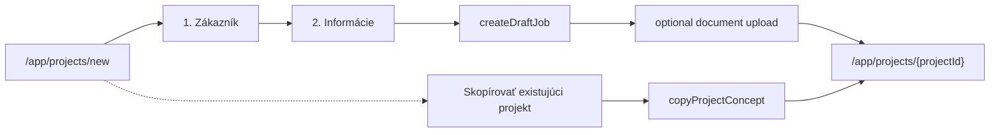

# Phase 1A — Simplified project creation

**Date:** 2026-07-20  
**Scope:** New-job wizard only. No quote editor, takeoff, catalog, rules, or AI setup changes beyond gating creation.

## Original flow

`/app/projects/new` → Typ práce → Zákazník → Spôsob (AI | Manual | Copy) → … → `createDraftJob` / AI CF →  
manual: `/app/projects/{id}` · AI: `/app/projects/{id}?setup=ai`

## New default flow

Steps: **Zákazník** → **Informácie** → **Vytvoriť projekt**.

## Feature flags

| Flag | Env | Default |
|------|-----|---------|
| Simplified creation | `NEXT_PUBLIC_ENABLE_SIMPLIFIED_PROJECT_CREATION` | **ON** (set `0` to rollback) |
| AI project creation | `NEXT_PUBLIC_ENABLE_AI_PROJECT_CREATION` | **OFF** (set `1` to enable) |
| Legacy work-type settings UI | `NEXT_PUBLIC_ENABLE_LEGACY_PROJECT_TYPE_SETTINGS` | **OFF** (set `1` to show) |

Central module: `src/lib/projectCreationFeature.ts`.

`isWizardAiGenerationEnabled()` now also requires `isAiProjectCreationEnabled()` — does **not** block opening historical `?setup=ai` projects.

## Legacy workType

New creates store Firestore archetype via `SIMPLIFIED_LEGACY_WORK_TYPE` = **`customer_job`**  
→ `projectType: TRADE`, engine `workType: REPAIR`, `jobArchetype: customer_job`.

UI modules do **not** branch on this value for the new flow.

## Lifecycle on create

Unchanged from `createDraftJob`:

- `phase: "sales"`
- `lifecycleStatus: "new_request"`
- `salesStatus: "draft"`
- `quoteStatus: "none"`

Optional new field: `countryCode` (workspace default, fallback SK).

## AI gating

- AI method card / ai-brief / ai-review **not rendered** when AI creation is off.
- No `?setup=ai` redirect from new create or copy.
- Historical projects: `projects/[id]/page.tsx` still mounts `AiProjectSetupWorkspace` when `?setup=ai` and draft/session exists.

## Copy flow

Secondary header button → `copyProjectConcept` → `/app/projects/{id}` (no AI).

## Upload behaviour

Files selected on Informácie step upload **after** `projectId` via `uploadProjectDocument`. Failures show warning; project remains; no second create.

## Redirect

Originally `/app/projects/{projectId}` (not `?setup=ai`).  
**Superseded by Phase 1B:** create/copy land on `/app/projects/{projectId}?tab=quote` when `NEXT_PUBLIC_ENABLE_MANUAL_QUOTE_WORKSPACE` is on. See `docs/implementation/manual-quote-bridge-phase-1b.md`.

## Changed / new files (summary)

- `src/lib/projectCreationFeature.ts` (+ test)
- `src/components/jobs/new/NewJobForm.tsx`
- `src/components/jobs/new/newJobWizardTypes.ts` (+ test)
- `src/components/jobs/new/NewJobPreviewPanel.tsx`
- `src/components/jobs/new/ai/AiCreationMethodStep.tsx`
- `src/services/ai/aiWizardGenerationService.ts`
- `src/services/projects/projectService.ts` (`countryCode`)
- `src/app/(app)/app/settings/company/page.tsx`
- `src/components/settings/WorkTypeSettings.tsx` (deprecated comment)
- `src/i18n/translations.ts`
- `e2e/projects-new.spec.ts`, `e2e/helpers/wizard.ts`
- `vitest.config.ts`

## Rollback

1. Set `NEXT_PUBLIC_ENABLE_SIMPLIFIED_PROJECT_CREATION=0`
2. Optionally `NEXT_PUBLIC_ENABLE_AI_PROJECT_CREATION=1`
3. Restart Next.js

Legacy wizard path returns; historical data unchanged.

## Tests

- Unit: `projectCreationFeature`, `newJobWizardTypes` — pass
- Typecheck — pass
- Build — pass
- Lint — pre-existing `_userId` warning in `projectService.ts`
- E2E authenticated — skipped without `E2E_EMAIL` / `E2E_PASSWORD`
