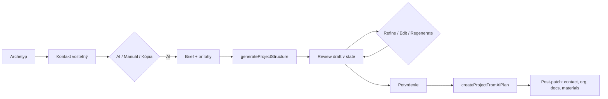

# Mobilná aplikácia Staveto — AI tvorba projektu / zákazky (zdroj pravdy)

**Účel:** Popis skutočného správania mobilnej aplikácie pri AI asistovanej tvorbe projektu v rámci wizardu „Nový projekt / Nová zákazka“. Dokument slúži ako zdroj pravdy pre zosúladenie Manager Web — **bez implementácie na webe v tomto kroku**.

**Stav:** Dokumentácia (analýza kódu mobilu).  
**Posledná revízia:** 2026-06-02  
**Referenčná cesta kódu:** `staveto-app_v2/mobile/src/` (primárne `UnifiedProjectCreationFlow`, `CreateProjectAIFlow`, `aiProjectService`, `aiProjectSchema`, `aiProjectDraft`)

**Súvisiace dokumenty:** [`mobile-source-of-truth-analysis.md`](./mobile-source-of-truth-analysis.md), [`web-alignment-plan-from-mobile.md`](./web-alignment-plan-from-mobile.md)

---

## 1. Executive summary

AI v Staveto mobile **nie je samostatný chatbot**. Je to **asistent na štruktúru projektu** vnorený do wizardu vytvorenia zákazky:

1. Používateľ zvolí **archetyp práce** (5 kariet).
2. Voliteľne priradí **kontakt / zákazníka**.
3. Zvolí spôsob štartu: **AI / manuál / kópia**.
4. Pri AI zadá **brief** a môže priložiť **dokumenty / fotky** (Storage, nie ešte projekt).
5. Backend vygeneruje **`AiProjectPlan`** (fázy, úlohy, voliteľné návrhy materiálov).
6. Používateľ **prehliada a upravuje** návrh v lokálnom stave (React state).
7. Môže **refinovať** jednu fázu alebo jednu úlohu cez callable.
8. **Až po explicitnom potvrdení** sa volá `createProjectFromAiPlan` — vtedy vzniká `projects/{projectId}` a podkolekcie.
9. Mobil potom **doplní** kontakt, workflow polia, business org, dokumenty a vybrané materiálové návrhy.

**Kľúčové invarianty:**

- Firestore projekt **neexistuje** počas generovania ani review.
- Plán žije v **klientskom stave** (`AiProjectDraft` s lokálnymi `id` uzlam).
- **`orgId` sa neposiela** do AI callables; firemný kontext sa **doplní po vytvorení** (`stampBusinessTeamProject`).
- Paywall **pred** AI v tomto flow **nebol nájdený**; paywall môže nasledovať po udalosti `project_created`.

---

## 2. Preskúmané súbory

| Súbor | Úloha |
|-------|--------|
| `components/UnifiedProjectCreationFlow.tsx` | Unified wizard: archetyp → kontakt → výber AI/manuál/kópia → delegácia na AI flow |
| `components/CreateProjectAIFlow.tsx` | UI brief, upload, generovanie, review, refine, confirm → `createProjectFromAiPlan` + post-patch |
| `services/aiProjectService.ts` | Callable klient: generate / create / refine / upload dokumentov |
| `lib/aiProjectSchema.ts` | `AiProjectPlan`, validácia, sanitizácia odpovede modelu |
| `lib/aiProjectDraft.ts` | Lokálny draft s `id`, mapovanie draft ↔ plan |
| `services/projects.ts` | `stampBusinessTeamProject` — org po vytvorení |
| `screens/ProjectsScreen.tsx` | `handleUnifiedCreationSuccess`, paywall po `project_created` |
| `services/paywallTrigger.ts` | `checkAndShowPaywall`, event `project_created` |
| `lib/projectEnums.ts` | `resolveInternalProjectTypeFromArchetype`, `resolveJobWorkflowKindFromArchetype` |

*(Backend implementácia callables je v Firebase Cloud Functions projekte `staveto-mvp-5f251`, región `europe-west1` — zdieľané s mobilom; nie v repozitári `staveto-office/functions`, ktorý má oddelené office draft callables.)*

---

## 3. Mobilná AI user journey

AI je súčasť **New project / New zákazka**, nie globálna konverzácia.

**Kroky v UI (`CreateProjectAIFlow`):**

| Fáza UI | Popis |
|---------|--------|
| `brief` | Text zadania, prílohy, voliteľný kontext archetypu / kontaktu |
| `generating` | Upload príloh + volanie `generateProjectStructure` |
| `review` | Editovateľný draft: fázy, úlohy, materiály, referenčné číslo |
| *(po confirm)* | Navigácia na prehľad projektu; projekt už v Firestore |

**Unified flow** (`flowVariant="unified"`): rovnaká AI logika, ale brief môže byť rozdelený na názov + popis; zobrazí sa súhrn kontaktu pri customer-facing archetypoch.

---

## 4. Input payload

### Callable: `generateProjectStructure`

**Región:** `europe-west1`  
**Autentifikácia:** Firebase ID token (`getIdToken(true)`)

| Pole | Povinné | Popis |
|------|---------|--------|
| `projectBrief` | áno | Hlavný text zadania (trim, neprázdny) |
| `projectDetails` | nie | Doplnkový kontext (archetyp hint, kontakt, workflow text) |
| `documentStoragePaths` | nie | Pole ciest v Storage (pozri §10) |
| `engineType` | nie | Forward-compatible engine hint |
| `workType` | nie | Granulárny engine work type (napr. `SERVICE`, `REPAIR`) |
| `jobWorkflowKind` | nie | `STANDARD` \| `SERVICE` |
| `serviceMaintenanceScope` | nie | `PROPERTY` \| `EQUIPMENT` (pri SERVICE) |

**Čo sa neposiela:**

- `orgId` / `activeBusinessOrgId`
- Finálny názov projektu z review (ten ide až do `createProjectFromAiPlan`)
- Celý `AiProjectDraft` s lokálnymi `id` (len pri refine sa posiela jeden uzol)

Mobil skladá `projectDetails` z archetyp AI hintu, kontaktu a workflow reťazca.

---

## 5. AI output structure

Schéma: `lib/aiProjectSchema.ts` — typ **`AiProjectPlan`**.

| Pole | Typ / poznámka |
|------|----------------|
| `projectTitle` | string |
| `category` | `construction` \| `renovation` \| `trade_installation` \| `service` \| `maintenance` |
| `scope` | `full_build` \| `partial_build` \| `single_trade` \| `small_job` |
| `summary` | voliteľný string |
| `uiMode` | voliteľný `phases` \| `work_packages` |
| `phases` | pole `{ name, description?, tasks[] }` |
| `tasks` (v rámci fázy) | `{ title, description?, taskType, priority }` |
| `taskType` | `execution` \| `coordination` \| `inspection` |
| `priority` | `low` \| `medium` \| `high` |
| `materialSuggestions` | voliteľné pole návrhov materiálov |

**Návrhy materiálov (`AiMaterialSuggestion`):** `name`, `category`, `description`, množstvo, ceny, `confidence`, `sourceNote`, väzba na `phaseName` / `taskTitle`.

**Nenájdené v schéme:** polia `assumptions`, `warnings` — mobil ich v type ani validácii nepoužíva.

Po odpovedi backendu mobil volá `validateAiProjectPlan` + `sanitizeAiProjectPlanFromModel`; pri chybe validácie používateľ vidí chybu a môže skúsiť znova alebo ísť manuálne.

---

## 6. Review / edit capabilities

Po generovaní sa plán premení na **`AiProjectDraft`** (`aiPlanToDraft`) — fázy/úlohy dostanú stabilné **lokálne `id`** pre UI a refine.

| Akcia | Kde | Persistencia |
|-------|-----|--------------|
| Upraviť názov projektu | review | len state |
| Upraviť referenčné číslo (`projectNumber`) | review | ide do `createProjectFromAiPlan` ako `referenceNumber` |
| Upraviť názov / popis fázy | review | len state |
| Vymazať fázu | review | len state |
| Upraviť názov / popis úlohy | review | len state |
| Vymazať úlohu | review | len state |
| Pridať manuálnu úlohu | review | len state |
| Regenerovať celý draft | review → brief | nové `generateProjectStructure` |
| Refine jednej fázy | review | `refineGeneratedProjectNode`, nahradí fázu v state |
| Refine jednej úlohy | review | rovnako pre úlohu |
| Zapnúť / vypnúť material suggestion | review | `selected` flag v draft |
| Späť na prompt | review → brief | state |
| Pokračovať manuálne | callback `onManual` | ukončí AI vetvu |

**AI nevytvára finálny projekt bez review** — tlačidlo confirm volá `createProjectFromAiPlan` až z review kroku.

---

## 7. Refinement flow

### Callable: `refineGeneratedProjectNode`

| Pole | Popis |
|------|--------|
| `projectBrief` | Pôvodný brief (kontext) |
| `draftSummary` | Skrátený súhrn draftu (max ~400 znakov) |
| `nodeKind` | `phase` \| `task` |
| `phaseIndex` | Index fázy v pláne |
| `taskIndex` | Pri `task` — index úlohy vo fáze |
| `currentPhaseJson` / `currentTaskJson` | Aktuálny uzol |
| `userChangeRequest` | Čo má AI zmeniť |
| `extraContext` | Voliteľný doplnok |

**Výsledok:** `{ kind: "phase", phase }` alebo `{ kind: "task", task }` — mobil **nahradí** príslušný uzol v lokálnom `draftPlan`, **bez** zápisu do Firestore.

Pri `NOT_FOUND` (funkcia nenasadená) mobil zobrazí chybu a ponúka ručnú úpravu.

---

## 8. Final Firestore persistence

### Callable: `createProjectFromAiPlan`

**Vstup:** `plan` (`AiProjectPlan` po `draftToAiProjectPlan` — len **vybrané** material suggestions), voliteľne `originalBrief`, `addressText`, `countryCode`, `city`, `projectNumber`.

**Backend (mobilný kontrakt) zapisuje minimálne:**

| Cesta | Obsah |
|-------|--------|
| `projects/{projectId}` | Hlavný dokument projektu (názov, typ, metadata z plánu) |
| `projects/{projectId}/members/{uid}` | Členstvo vlastníka |
| `users/{uid}/projectRefs/{projectId}` | Odkaz pre rýchly zoznam |
| `projects/{projectId}/phases/{phaseId}` | Fázy z AI plánu |
| `projects/{projectId}/tasks/{taskId}` | Úlohy z AI plánu |

**Dôležité:** Backend **momentálne nezapisuje** `materialSuggestions` priamo do `projects/.../materials`. Návrhy materiálov rieši klient **po** vytvorení (pozri §9).

### Post-create patche (mobil, `CreateProjectAIFlow.handleCreate`)

| Krok | Podmienka | Akcia |
|------|-----------|--------|
| Workflow | `jobWorkflowKind` / `serviceMaintenanceScope` | `patchProjectDocument` |
| Kontakt | `selectedContact` | `patchPrimaryContactToProject` |
| Dokumenty | lokálne prílohy z brief kroku | `saveNewJobAttachmentsToProjectDocuments` |
| Materiály | `materialSuggestions` s `selected: true` | `createMaterialSuggestionsBatch` |
| Business org | `activeBusinessOrgId` v `ProjectsScreen` | `stampBusinessTeamProject(projectId, orgId)` **mimo** AI callables |
| Notifikácia | vždy po create | `createProjectCreatedNotification` |

Predajná fáza zákazky (web polia `phase: sales`, …) môže byť v office/backende doplnená inak; mobilný `createProjectFromAiPlan` rieši **štruktúru delivery** (fázy/úlohy). Web wizard manuálnej zákazky používa sales draft polia oddelene — pri AI parite treba explicitne zosúladiť (otázka v §17).

---

## 9. Materials behavior

| Fáza | Správanie |
|------|-----------|
| AI generate | `materialSuggestions` môžu prísť v `AiProjectPlan` (ak backend podporí v prompte/schéme) |
| Review | Používateľ prepína `selected` na jednotlivých návrhoch; default selekcia filtruje `low` confidence a niektoré kategórie |
| Confirm | Do `createProjectFromAiPlan` idú **len vybrané** návrhy (strip `id`/`selected`) |
| Firestore | Backend create **nezapisuje** materiály automaticky |
| Po create | Mobil volá `createMaterialSuggestionsBatch` → návrhy v projekte ako suggestions, nie finálny sklad |

**Materiály sú návrhy, kým ich používateľ neprijme** v projekte (mobilný materiálový modul).

---

## 10. Documents / photos behavior

| Fáza | Správanie |
|------|-----------|
| Upload pred generovaním | `uploadAiDraftDocument` → Storage |
| Cesta | `users/{uid}/aiProjectDrafts/{draftId}/documents/{fileName}` |
| AI vstup | Pole `documentStoragePaths` v `generateProjectStructure` |
| Po confirm | Súbory s `localUri` sa kopírujú do projektu cez `saveNewJobAttachmentsToProjectDocuments` |
| Pred confirm | **Nie** sú viazané na `projects/{id}` — žiadny project document |

Fotky a PDF slúžia ako **kontext pre generovanie**; trvalá väzba na projekt až po potvrdení.

---

## 11. Business org behavior

| Téma | Mobilné správanie |
|------|-------------------|
| AI callables | **Neprijímajú** `orgId` |
| Kontext firmy | `hasActiveBusinessOrgId` len ovplyvňuje UI (kontakty z org CRM cez `ContactPickerSheet` s `orgId={activeBusinessOrgId}`) |
| Po vytvorení | `ProjectsScreen.handleUnifiedCreationSuccess`: ak `activeBusinessOrgId`, volá `stampBusinessTeamProject(projectId, activeBusinessOrgId)` |
| Osobný režim | Bez stamp — projekt zostane personal (`ownerId`) |

Web pri parite musí rovnako **stampnúť org až po create**, nie posielať org do Gemini promptu ako náhradu za workspace.

---

## 12. Safety / paywall behavior

| Kontrola | Nájdené |
|----------|---------|
| Paywall pred `generateProjectStructure` | **Nie** v `CreateProjectAIFlow` / `aiProjectService` |
| Paywall po vytvorení projektu | **Áno** — `ProjectsScreen`: `trackPaywallEvent("project_created")` + `checkAndShowPaywall(..., "project_created")` |
| Auth | Callable vyžaduje prihláseného používateľa + platný ID token |
| Validácia AI JSON | Client-side `validateAiProjectPlan` pred zobrazením review |

AI nie je „bezplatný chat“ — je viazaný na vytvorenie projektu a následné produktové limity môžu kick-in **po** create.

---

## 13. Errors / fallback behavior

| Situácia | Správanie |
|----------|-----------|
| Prázdny brief | Validácia pred volaním — chyba |
| Callable zlyhá | Správa používateľovi; možnosť skúsiť znova |
| Neplatný AI JSON | `Invalid AI response` + detail validácie |
| `refineGeneratedProjectNode` NOT_FOUND | Chyba + ručná úprava |
| Upload dokumentu zlyhá | Stav `failed` na položke; generovanie môže pokračovať bez cesty |
| Create zlyhá | Chyba na review; draft v state zostáva |
| Post-patch zlyhá (contact, materials, docs) | Log warning; projekt už existuje — **non-fatal** |

**Fallback:** `onManual` / „pokračovať manuálne“ — používateľ opustí AI vetvu bez straty archetypu/kontaktu v unified flow.

---

## 14. Čo musí web skopírovať presne

1. **Umiestnenie:** AI len v `/app/projects/new` (po archetype + kontakte), nie globálny chat.
2. **Callables (mobilné):** `generateProjectStructure`, `refineGeneratedProjectNode`, `createProjectFromAiPlan` — región **`europe-west1`**.
3. **Schéma:** `AiProjectPlan` / `AiProjectDraft` — rovnaké polia a validácia.
4. **Žiadny Firestore projekt** pred confirm — draft v pamäti (React state / session).
5. **Storage cesty** pre prílohy: `users/{uid}/aiProjectDrafts/{draftId}/documents/...` → `documentStoragePaths`.
6. **Review UI:** edit fázy/úloh, refine uzla, regenerate, späť na brief.
7. **Confirm:** jediný zápis projektu cez `createProjectFromAiPlan`; potom post-patch ako mobil.
8. **Archetyp → engine:** `engineType`/`workType`/`jobWorkflowKind` z mapovania archetypu (BUILD/TRADE), nie uloženie archetypu do `projectType`.
9. **Materiály:** len suggestions po create; žiadny automatický sklad.
10. **Org:** stamp po create, nie v AI payload.

---

## 15. Čo web zatiaľ nemá implementovať

- Globálny AI chat / asistent mimo wizardu zákazky.
- Automatické odosielanie e-mailov, ponúk, faktúr z AI kroku.
- Automatické vytvorenie `quotes/{id}` alebo odoslanie cenovej ponuky.
- Kalendár, Gantt, resource planning z AI draftu.
- Nové Firestore kolekcie (napr. root `aiChats/`).
- Migrácia existujúcich projektov cez AI.
- Nahradenie mobilných callables **office-only** draft API (`generateProjectDraft`, `createProjectFromDraft`) ako dlhodobé riešenie — to je interim web stack, nie mobile parity.
- Paywall UI na webe skopírovaný z RevenueCat (pokiaľ nie je samostatná úloha).

*(Poznámka: Web už môže mať čiastočný AI krok s inými callables — to **nie je** zdroj pravdy; cieľom je konvergencia na mobilné callables a `AiProjectPlan`.)*

---

## 16. Odporúčaný plán implementácie v prehliadači

| Fáza | Obsah |
|------|--------|
| **A — Kontrakt** | Zdieľať `aiProjectSchema.ts` medzi web a functions; overiť nasadenie 3 mobilných callables v `europe-west1` |
| **B — Wizard slot** | V `NewJobForm` krok `concept` + vetva `creationMethod === "ai"`: brief, upload, generate, review (nie okamžitý `createProjectFromDraft`) |
| **C — State** | `AiProjectDraft` v React state; žiadny zápis do `projects/` pred confirm |
| **D — Review UI** | Panel fáz/úloh + refine + edit + material toggles (parita s `CreateProjectAIFlow`) |
| **E — Confirm** | `createProjectFromAiPlan` + post-patch: contact, `jobWorkflowKind`, org stamp, documents, materials |
| **F — Sales draft** | Po create doplniť web polia `phase: sales`, `lifecycleStatus: new_request`, … ak backend create ich ešte nenastavuje |
| **G — Chyby** | Mapovanie NOT_FOUND / permission / validation; fallback na manuál |

**Umiestnenie v produkte:** hneď po výbere archetypu a kroku zákazníka/kontextu, pred finálnym uložením manuálnej zákazky — presne ako unified mobile flow.

---

## 17. Otvorené otázky

1. **`createProjectFromAiPlan` a sales fáza:** Nastavuje mobilný backend automaticky `phase: sales` a draft lifecycle, alebo musí web po create patchnúť rovnako ako pri `createDraftJob`?
2. **Jednotný vs. office callable stack:** Kedy vypnúť / deprecate `generateProjectDraft`, `updateProjectDraftWithAI`, `createProjectFromDraft` v `staveto-office/functions`?
3. **`jobArchetype` na projekte:** Má sa po AI create patchnúť rovnako ako pri manuálnom web wizardi?
4. **`assumptions` / `warnings`:** Má backend doplniť polia do schémy, alebo ich web vôbec nezobrazovať?
5. **Business workspace:** Má AI brief posielať `projectDetails` s názvom firmy bez `orgId`, alebo len archetyp hint?
6. **Index / rules:** Sú Storage pravidlá pre `users/{uid}/aiProjectDrafts/**` identické medzi web a mobile uploadom?

---

*Koniec dokumentu — AI tvorba projektu (mobilný zdroj pravdy).*
