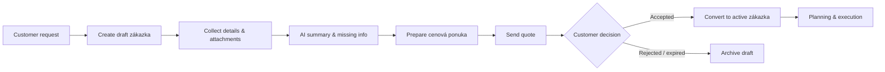
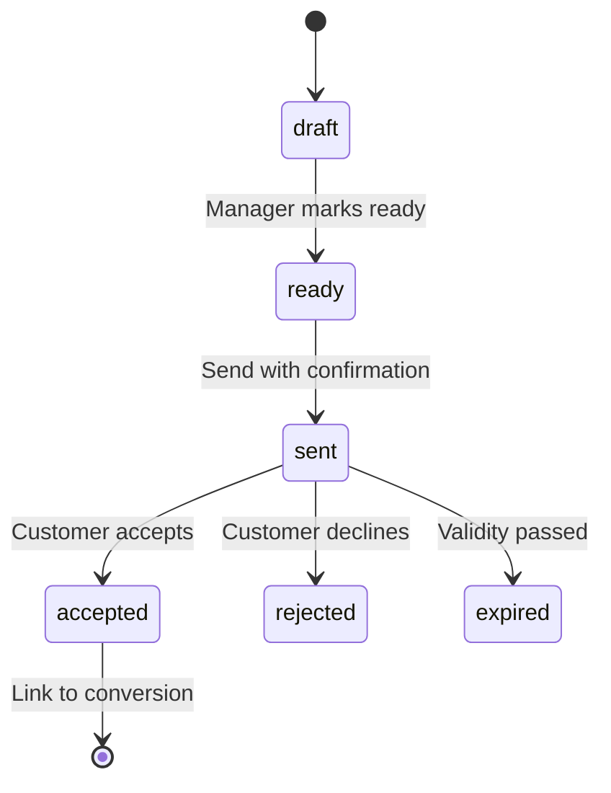

# Staveto — Draft zákazky & quote preparation flow

**Document purpose:** Product vision, UX architecture, and implementation plan for the pre-sales **zákazka** lifecycle in Staveto Manager — from customer request through draft quote to active project.  
**Status:** Proposal only — **no implementation**, **no Firebase schema changes**, **no AI**, **no project module changes** in this phase.  
**Last reviewed:** 2026-06-02  
**Evidence baseline:** `staveto-office` MVP (`projects` Firestore, in-memory `/api/estimates`, sidebar **Zákazky** → `/app/projects`). Mobile repo not in workspace.

**Related docs:** [`staveto-manager-architecture.md`](./staveto-manager-architecture.md), [`staveto-manager-feature-inventory.md`](./staveto-manager-feature-inventory.md), [`staveto-manager-product-ux-standards.md`](./staveto-manager-product-ux-standards.md), [`staveto-web-onboarding-proposal.md`](./staveto-web-onboarding-proposal.md).

---

## Evidence tags

| Tag | Meaning |
|-----|---------|
| **Verified** | Present or stated in `staveto-office` today. |
| **Inferred** | Expected from construction SaaS / mobile conventions; not inspectable here. |
| **Planned** | Target design pending approval. |
| **Blocked** | Requires mobile schema, legal, or infra not in workspace. |

---

## 1. Product vision

Staveto Manager must support work **before** a site job exists. Construction companies rarely start at “active project”; they start with a **customer request** (call, email, photos, PDF, message) and need to **collect context**, **prepare an accurate cenová ponuka**, and only then **execute** the work.

**Zákazka** (user-facing term) spans two phases:

1. **Sales / draft phase** — capture request, attachments, missing-info checklist, AI-assisted analysis, quote draft, send & track response.  
2. **Delivery phase** — after acceptance, same record becomes the operational **active zákazka / project** (planning, tasks, attendance, expenses, documents).

Vision in one line:

> **Customer request → draft zákazka → informed quote → customer approval → active zákazka** — one continuous story, minimal duplicate data entry, mobile-safe evolution on shared Firebase.

This aligns with Manager UX standards: simple screens, obvious next action, progressive disclosure, SK-first copy, AI as **draft-only assistant**, manager confirms all sensitive actions.

---

## 2. User problems

| Problem | Who feels it | Today in Manager |
|---------|----------------|------------------|
| Requests arrive scattered (email, WhatsApp, photos) | Manager, back office | No unified “request inbox”; projects created only when work is already assumed **Verified** gap |
| Creating a “project” too early pollutes active job lists | Manager | `/app/projects/new` creates operational project immediately **Verified** |
| Missing scope details discovered late | Manager, estimator | No checklist / AI gap analysis **Planned** |
| Quote prep disconnected from job context | Manager, accountant | Estimates live in **in-memory** API, not linked to `projects` **Verified** |
| No clear quote status (sent / accepted / rejected) | Manager | Estimate store has no shared lifecycle with jobs **Verified** |
| Conversion after win is manual re-entry | Manager | No “accept quote → activate job” flow **Planned** |
| Field team sees draft/sales noise | Worker | Mobile likely lists “projects” for real jobs only **Inferred** |

---

## 3. Recommended workflow

End-to-end flow managers should experience:

### Step-by-step (manager-facing)

| Step | Manager action | System behavior |
|------|----------------|-----------------|
| 1 | **Nová zákazka (koncept)** from dashboard, Zákazky, or customer context | Create record in **draft/sales** state; do not show as active site job on mobile filters **Planned** |
| 2 | Enter or paste request; optionally link customer | Save `customerRequest`, contact fields, `source` **Planned** |
| 3 | Upload photos/PDFs or note “from email” (manual paste in MVP) | Attachments metadata + Storage later **Planned** |
| 4 | Review **missing information** checklist; use AI panel (later) | Checklist + suggested questions **Planned** |
| 5 | **Pripraviť ponuku** — open quote workspace | Create/link quote draft; line items **Planned** |
| 6 | Export PDF / send email (later) | Status → `quote_sent`; confirmation before send **Planned** |
| 7 | Mark accepted or sync from customer reply | Status → `accepted` **Planned** |
| 8 | **Previesť na aktívnu zákazku** | Set delivery lifecycle; link `acceptedQuoteId`; activity log **Planned** |

---

## 4. Draft job lifecycle / statuses

### 4.1 Sales phase (`salesStatus` on zákazka)

Use clear, ordered statuses (not all need automation in MVP):

| Status | SK label (UI) | Meaning |
|--------|---------------|---------|
| `new_request` | Nová požiadavka | Just created; minimal data |
| `collecting_info` | Zbieranie podkladov | Manager adding notes, files, context |
| `needs_customer_input` | Čaká na zákazníka | Blocked on customer answers |
| `ready_for_quote` | Pripravené na ponuku | Checklist satisfied enough to quote |
| `quote_drafted` | Ponuka rozpracovaná | Quote exists in draft |
| `quote_sent` | Ponuka odoslaná | Sent to customer (manual confirm in MVP) |
| `accepted` | Prijaté | Customer accepted |
| `rejected` | Zamietnuté | Customer declined |
| `converted_to_project` | Prevedené na zákazku | Handed off to delivery phase |
| `archived` | Archivované | Closed without conversion |

Allowed transitions should be **validated in service layer** (e.g. cannot `converted_to_project` without `accepted` + confirmed quote).

### 4.2 Delivery phase (`lifecycleStatus` after conversion)

Separate from sales — operational job states (align with mobile when known):

| Status | SK label (UI) | Meaning |
|--------|---------------|---------|
| `planned` | Naplánované | Accepted; not started on site |
| `in_progress` | Prebieha | Active work |
| `paused` | Pozastavené | Temporarily stopped |
| `completed` | Dokončené | Work finished |
| `archived` | Archivované | Historical |

**Rule:** Until conversion, `lifecycleStatus` is `null` or `sales_only`. After conversion, `salesStatus` becomes `converted_to_project` and `lifecycleStatus` becomes `planned` (default).

### 4.3 Quote status (linked document)

Track on quote/estimate entity (Firestore later):

| `quoteStatus` | Meaning |
|---------------|---------|
| `draft` | Editable |
| `ready` | Internal review complete |
| `sent` | Delivered to customer |
| `accepted` | Won |
| `rejected` | Lost |
| `expired` | Past validity date |

---

## 5. Required UI screens

User-facing term: **zákazka**. Code may keep `project` IDs/paths until a rename phase.

### Route strategy (recommended)

**Keep current routes** to avoid breaking sidebar, dashboard links, and mobile-aligned paths:

| Route | Screen | Notes |
|-------|--------|-------|
| `/app/projects` | **Zákazky** — list with tabs/filters: Koncepty \| Aktívne \| Archív | **Verified** path today |
| `/app/projects/new` | **Nová zákazka** — wizard: source + customer + popis | Extend create flow **Planned** |
| `/app/projects/[id]` | **Detail zákazky** — layout depends on phase | **Verified** today |
| `/app/projects/[id]?tab=context` | Kontext požiadavky (attachments, email notes) | Or sub-route **Planned** |
| `/app/projects/[id]?tab=quote` | Cenová ponuka | **Planned** |
| `/app/projects/[id]?tab=activity` | História / timeline | **Planned** |

Optional later aliases (redirect only): `/app/jobs` → `/app/projects` — **not required for MVP**.

### Screen specs (UX)

#### A. List — `/app/projects`

- Filters: **Koncepty** (sales statuses), **Aktívne** (`lifecycleStatus` in progress), **Všetky**, **Archív**.
- Row: name, customer, `salesStatus` badge, quote status, last activity, address snippet.
- Primary CTA: **Nová zákazka**.
- Empty states per filter with clear next step (per product UX standards).

#### B. Create — `/app/projects/new`

**Input channels (progressive; MVP = manual first):**

| Source | MVP | Later |
|--------|-----|-------|
| Manual description | Yes | — |
| Existing customer | Placeholder / simple fields | Customer picker |
| Uploaded photos | Placeholder UI | Storage upload |
| PDF / documentation | Placeholder UI | Storage + OCR |
| From customer email | Placeholder + paste thread | Email integration |
| Social message | Disabled “Čoskoro” | Integration |

Minimum fields MVP: title/name, customer name, optional email/phone, request description, address/city, source enum.

#### C. Draft workspace — `/app/projects/[id]` (sales phase)

Single page with sections (tabs or scroll on mobile):

| Section | Content |
|---------|---------|
| Header | Status, customer, address, primary actions (Pripraviť ponuku, Označiť odoslané, Previesť…) |
| Požiadavok zákazníka | Description, source, received date |
| Kontakt | Name, email, phone |
| Prílohy | Photos, PDFs (placeholder list in MVP) |
| Komunikácia | Email thread notes / pasted content (MVP: notes field) |
| Poznámky | Internal notes |
| Chýbajúce informácie | Checklist (template + manual ticks) |
| AI asistent | Summary, scope, questions, risk — **placeholder** in MVP |
| Ponuka | Status, link to quote tab, last sent date |
| Aktivita | Timeline stub |

#### D. Quote — `/app/projects/[id]` tab `quote`

- Line items table (reuse estimates UX patterns later).
- Totals, validity date, terms note.
- Actions: Uložiť koncept, Označiť pripravené, Export PDF (later), Odoslať (later, confirm dialog).
- Banner: “Ponuka nie je záväzná, kým ju neodošlete a zákazník nepotvrdí.”

#### E. Conversion modal

- Trigger: only when `salesStatus === accepted` (or manager override with reason).
- Confirm: link quote, set `lifecycleStatus = planned`, `convertedAt`, activity entry.
- Copy: “Zákazník prijal ponuku. Chcete spustiť realizáciu zákazky?”

---

## 6. Data model proposal

**Do not implement yet.** All changes must be **additive** and **mobile-safe** (see architecture tenets).

### 6.1 Option A — Extend `projects` with sales lifecycle (recommended)

Store draft and active zákazky in existing top-level `projects` collection (**Verified** path today).

**Pros**

- One ID end-to-end; conversion is a **status update**, not a copy/migrate.
- Reuses `ownerId` / `orgId` workspace scoping **Verified**.
- Mobile can **ignore** documents where `phase === 'sales'` or `lifecycleStatus == null` until app is updated **Inferred**.
- Subcollections (`tasks`, `expenses`) naturally gated until post-conversion.

**Cons**

- `projects` semantic overload (“project” vs “draft”).
- Requires disciplined queries (always filter by phase/status).
- Mobile must not treat drafts as on-site jobs **Blocked** until mobile filter agreed.

**Recommended additive fields on `projects/{projectId}`:**

| Field | Type | Purpose |
|-------|------|---------|
| `phase` | `"sales" \| "delivery"` | High-level partition |
| `salesStatus` | enum (see §4.1) | Pre-sales workflow |
| `lifecycleStatus` | enum (see §4.2) \| null | Post-conversion only |
| `customerRequest` | string | Raw request text |
| `customerName` | string | |
| `customerEmail` | string | |
| `customerPhone` | string | optional, only if mobile-verified later |
| `source` | `"manual" \| "email" \| "phone" \| "photos" \| "pdf" \| "social" \| "existing_customer"` | |
| `quoteStatus` | enum (see §4.3) \| null | Denormalized from latest quote |
| `acceptedQuoteId` | string \| null | |
| `convertedAt` | timestamp \| null | |
| `requestReceivedAt` | timestamp | |
| `missingInfoChecklist` | map or array | `{ id, label, done }[]` |
| `aiSummaryUpdatedAt` | timestamp \| null | **Planned** |
| `createdBy` | uid | audit-friendly |
| `source: "web"` | string | already used on create **Verified** pattern |

Existing fields retained: `name`, `addressText`, `city`, `ownerId`, `orgId`, `workspaceType`, `workspaceId`, timestamps.

**Recommended subcollections (later phases)**

| Path | Purpose |
|------|---------|
| `projects/{id}/attachments` | File metadata + Storage path |
| `projects/{id}/communications` | Email/note entries |
| `projects/{id}/aiSummaries` | Versioned AI outputs (draft-only) |
| `projects/{id}/quoteDrafts` | Or link to workspace `quotes` collection |
| `projects/{id}/activity` | Immutable activity events |

**Query patterns (Manager web)**

- Koncepty: `phase == 'sales' AND salesStatus NOT IN ('converted_to_project', 'archived')`.
- Aktívne: `phase == 'delivery' AND lifecycleStatus IN ('planned', 'in_progress', 'paused')`.
- Mobile (default): `phase == 'delivery'` only **Inferred** contract.

### 6.2 Option B — Separate `jobRequests` then convert

Example: `organizations/{orgId}/jobRequests/{id}` or `workspaces/{workspaceId}/jobRequests/{id}`.

**Pros**

- Clean separation of sales vs delivery entities.
- Mobile never sees drafts.

**Cons**

- **Conversion = copy + link + delete?** — duplication risk, broken attachments references, two rule sets.
- New collection + indexes + mobile/web divergence from current `projects` truth **High migration risk**.
- Conflicts with “one Firebase project, one truth” for “the job” **Architecture tension**.

### 6.3 Recommendation

**Choose Option A** — extend `projects` with `phase`, `salesStatus`, and `lifecycleStatus`, plus subcollections over time.

**Conditions before implementation**

1. Confirm with mobile team: filter rule for listing projects on site.  
2. Confirm Firestore quotes schema path (replace in-memory estimates). **Blocked** in workspace.  
3. Document dual-read period: old projects without `phase` treated as `delivery` / `in_progress` **Planned**.

---

## 7. AI assistant role

AI is a **safe manager assistant** inside the draft workspace — not a chatbot that acts alone.

### Capabilities (target)

| Capability | Output | Input |
|------------|--------|-------|
| Summarize request | Short SK summary | Description, notes, email paste |
| Extract scope | Bullet list of work items | Text, PDF text (later) |
| Missing info | Checklist suggestions | Summary + templates by trade |
| Customer questions | Suggested email/message bullets | Gaps |
| Quote structure | Suggested sections/line item stubs | Scope |
| Complexity / risk | Low/medium/high + rationale | Scope, photos metadata (later) |
| Draft email | Reply text draft | Thread + summary |
| Draft offer intro | Cover letter text for PDF | Customer + scope |

### Non-goals (hard rules)

- Must **not** send email automatically.  
- Must **not** create **final** quotes or change prices without explicit confirmation.  
- Must **not** convert to active zákazka automatically.  
- Must **not** delete data or change permissions.  
- All outputs stored as **draft** records (`aiSummaries` with `status: draft`).

### UX pattern

- Panel: “Návrh asistenta” with **Obnoviť návrh**, **Použiť do ponuky** (fills draft fields), **Zahodiť**.
- Each destructive or external action uses existing **confirmation** pattern from product standards.

### MVP

Static placeholder: “AI asistent bude dostupný v ďalšej fáze” + example empty states — **no model calls**.

---

## 8. Required integrations

| Integration | Purpose | Phase |
|-------------|---------|-------|
| Firestore `projects` | Draft + active zákazka | MVP+ |
| Firestore quotes (mobile-aligned) | Real quote persistence | Phase 2 **Blocked** schema |
| Firebase Storage | Photos, PDFs | Phase 2 |
| Email (SMTP / Gmail / Microsoft) | Ingest thread, send quote | Phase 3 |
| PDF generation | Quote export | Phase 2 |
| OCR / document parsing | PDF scope extraction | Phase 3 |
| Social (WhatsApp / Messenger) | Inbound requests | Phase 4+ |
| Calendar | Post-conversion planning | Separate module |
| Accounting export | Won quotes | Later |

**Verified today:** in-memory `/api/estimates` only — migration plan required before production quotes.

---

## 9. Quote preparation flow

| Step | Manager | System |
|------|---------|--------|
| 1 | Open **Ponuka** from draft zákazka | Load or create quote draft linked to `projectId` |
| 2 | Edit line items, DPH, notes | Autosave draft `quoteStatus: draft` |
| 3 | Internal review | `quoteStatus: ready` |
| 4 | Export PDF / Send | `quote_sent`; confirm dialog; log activity |
| 5 | Record outcome | `accepted` / `rejected` / `expired` |
| 6 | Convert zákazka | `salesStatus: converted_to_project`, `acceptedQuoteId` set |

**Linking:** `projects.acceptedQuoteId` → `quotes/{id}` (exact collection TBD with mobile).

**Estimates MVP gap:** Until Firestore quotes exist, use **read-only placeholder** or continue in-memory with explicit `projectId` foreign key in API — **technical debt** to resolve in Phase 2.

---

## 10. Email / document / photo context handling

### Email (later)

- **Inbound:** OAuth mailbox or forwarded address → `communications` subcollection; manager approves import into zákazka.  
- **MVP:** Text area “Prilepiť text z emailu” + `source: email`.  
- **Outbound:** Template + PDF attachment; send only after confirmation; log `communicationId`.

### Documents / PDF (later)

- Upload to Storage → `attachments` with `type: pdf`.  
- Optional OCR pipeline → text for AI (Phase 3).  
- **MVP:** “Pridať dokument” disabled + Čoskoro; manual note field.

### Photos (later)

- Mobile-friendly upload grid; link to Storage paths.  
- **MVP:** placeholder list; optional manual URL/note.

### Existing customer (later)

- Picker from `customers` collection **Inferred**; MVP: free-text `customerName` / `customerEmail`.

### Provenance

Every attachment/communication record should include: `createdAt`, `createdBy`, `source`, `projectId` (zákazka id).

---

## 11. Safety and confirmation rules

| Action | Requires manager confirmation |
|--------|------------------------------|
| Send quote email | Yes |
| Mark quote sent | Yes (if not auto from email) |
| Mark quote accepted | Yes (optionally attach proof note) |
| Convert to active zákazka | Yes — modal with summary |
| Delete draft zákazka | Yes — type name or second step |
| AI “apply to quote” | Yes — preview diff |
| Change line item prices from AI | Yes — per row or batch |
| Archive / reject | Soft confirm |

**Audit:** Each confirmed action appends `activity` event: `{ type, actorUid, at, meta }`.

Align with [`staveto-manager-product-ux-standards.md`](./staveto-manager-product-ux-standards.md) AI rules.

---

## 12. MVP scope (first implementation after approval)

**Goal:** Prove workflow UX without new backends.

| Include | Detail |
|---------|--------|
| Manual draft creation | Extended `/app/projects/new` form (customer + request + source) |
| Status lifecycle | `phase`, `salesStatus` fields + service transitions (Firestore additive) |
| List filters | Koncepty vs Aktívne on `/app/projects` |
| Draft workspace UI | Sections with real text fields; attachments/AI/quote **placeholders** |
| Missing info checklist | Static template + manual checkboxes |
| Quote tab placeholder | “Ponuka bude prepojená v ďalšej fáze” or basic link to `/estimates/new?projectId=` query param |
| Conversion placeholder | Button opens confirm modal; writes `converted_to_project` + `lifecycleStatus: planned` when approved |
| Activity stub | Local or Firestore minimal `activity` entries for create/status/convert |
| i18n SK | zákazka terminology |
| Services layer | `src/services/jobs/` or `src/services/projects/` — no UI Firestore |

| Exclude from MVP | Reason |
|------------------|--------|
| Real AI | Proposal only |
| Email ingest/send | Integration |
| Storage uploads | Storage rules + UI |
| OCR / PDF parse | Integration |
| Social | Integration |
| Firestore quotes migration | Blocked on mobile schema |
| PDF export | Separate service |
| New `jobRequests` collection | Option B deferred |
| Mobile app changes | Coordinate separately |

---

## 13. Later phases

| Phase | Deliverables |
|-------|----------------|
| **P1 — Data & quotes** | Mobile-aligned `quotes` in Firestore; link to `projects`; deprecate in-memory estimates |
| **P2 — Attachments** | Storage, thumbnails, PDF viewer |
| **P3 — AI drafts** | Callable orchestrator, `aiSummaries`, confirmation UX |
| **P4 — Email** | Thread import + send quote with PDF |
| **P5 — PDF & branding** | Company logo, terms, SK legal fields |
| **P6 — Customers** | Shared customer directory |
| **P7 — Reporting** | Pipeline: drafts → sent → won rate |
| **P8 — Mobile parity** | Field visibility rules for active jobs only |

---

## 14. Implementation plan

### Phase 0 — Approval (current)

- [x] This document  
- [ ] Stakeholder sign-off on Option A + statuses + routes  
- [ ] Mobile filter contract for `phase` / `salesStatus`  

### Phase 1 — Types & services (web only, additive FS)

1. Extend `ProjectDoc` types with optional sales fields (no breaking renames).  
2. `projectService.createDraftJob()`, `updateSalesStatus()`, `convertToDelivery()`.  
3. Update `listProjectsForWorkspace` with `phase` filter parameter.  
4. Firestore rules review — drafts writable by workspace members only.  
5. Default legacy projects: `phase: 'delivery'`, `lifecycleStatus: 'in_progress'` in read mapper.

### Phase 2 — UI routes

1. `/app/projects` — tabs Koncepty / Aktívne.  
2. `/app/projects/new` — draft-first form.  
3. `/app/projects/[id]` — conditional layout: sales vs delivery (hide tasks/expenses until converted).  
4. Dashboard: “Koncepty čakajúce na ponuku” count when query cheap.

### Phase 3 — Quote link

1. Resolve mobile quote schema **Blocked**.  
2. `quoteService` + project link.  
3. Replace placeholders in quote tab.

### Phase 4 — AI & integrations

Per §13.

**Estimated dependency order:** 0 → 1 → 2 → (parallel mobile) → 3 → 4.

---

## 15. Risks and open questions

### Risks

| Risk | Impact | Mitigation |
|------|--------|------------|
| Mobile lists draft projects as active jobs | Field confusion | `phase` filter; mobile release gate |
| Estimates / quotes split brain | Wrong financial data | Prioritize Firestore quote schema decision |
| Status enum sprawl | UX complexity | Group UI into 4 badges max; full enum in admin |
| AI over-trust | Wrong quotes sent | Draft-only + confirm; no auto-send |
| Email GDPR / retention | Legal | Policy + retention job **Blocked** legal |
| Conversion without quote | Incomplete audit | Warn in modal; allow override with reason |

### Open questions

1. Exact Firestore path and shape for mobile **quotes**? (**Blocked** without mobile repo.)  
2. Should rejected drafts auto-archive after N days?  
3. Single zákazka vs multiple quote versions (rev 2, rev 3)?  
4. Is `customerPhone` already on mobile customer model?  
5. Who can convert — admin only or any manager?  
6. Czech vs Slovak quote PDF legal fields?  
7. Rename collection `projects` → `jobs` in API only, or user-facing only? **Recommend user-facing “zákazka” only for now.**  
8. Do tasks/expenses subcollections exist on drafts today? Should creation be blocked in rules? **Recommend rules: no tasks until `phase === 'delivery'`.**

---

## Summary — recommended approach

| Topic | Recommendation |
|-------|----------------|
| **Data** | **Option A** — additive sales fields on existing `projects` |
| **Routes** | Keep `/app/projects/*`; label **Zákazka** in UI |
| **Lifecycle** | `salesStatus` (pre-sales) + `lifecycleStatus` (after conversion) |
| **Quotes** | Link to future Firestore quotes; interim query-param to estimates MVP optional |
| **AI** | Draft-only panel; placeholder in MVP |
| **MVP** | Manual draft + statuses + workspace UI + conversion confirm — no AI/email/storage |

### Minimal safe implementation steps (after approval)

1. Document mobile listing filter agreement.  
2. Add optional types + mappers (default legacy → delivery).  
3. Implement `projectService` draft CRUD + status transitions.  
4. Update Firestore rules for phase-gated subcollections.  
5. Ship list/create/detail UI with placeholders.  
6. Add conversion confirmation + activity log.  
7. Defer quotes, AI, email, Storage to Phase 2+.

### Do not implement yet

- New `jobRequests` collection (Option B).  
- Breaking rename of `projects` collection.  
- Automatic AI actions or email send.  
- OCR, social, calendar, invoices.  
- Changing onboarding, workspace, subdomain, or sidebar structure for this feature.  
- Fake AI summaries or fake attachment data in production.

---

## Appendix — Sidebar alignment

**Verified:** Sidebar **Zákazky** → `/app/projects`. New flow should strengthen this entry (Koncepty filter, **Nová zákazka** CTA) without new top-level nav until pipeline metrics justify it.

---

*End of proposal.*
