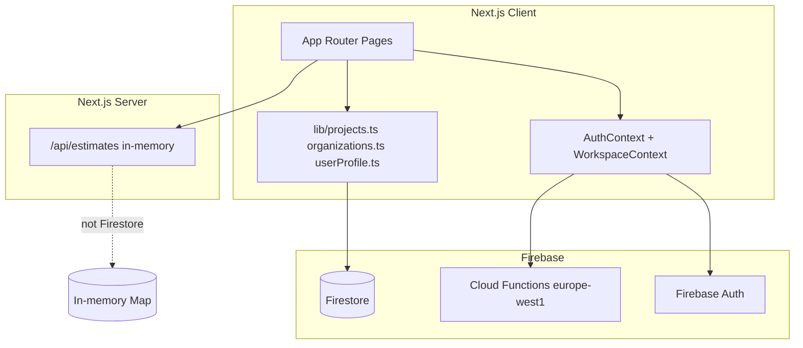
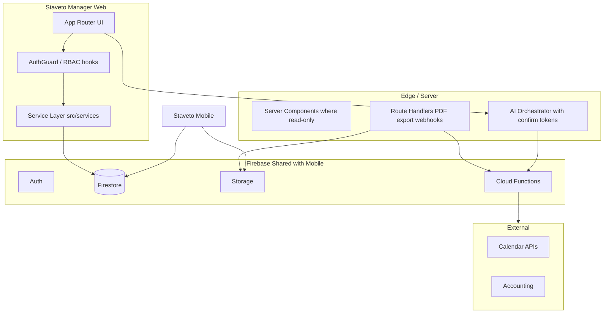
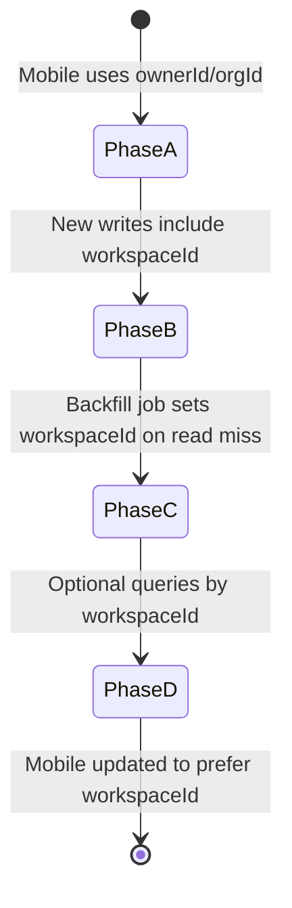
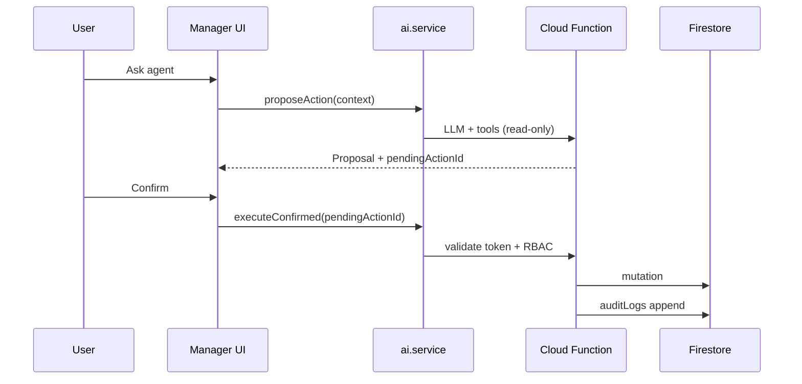
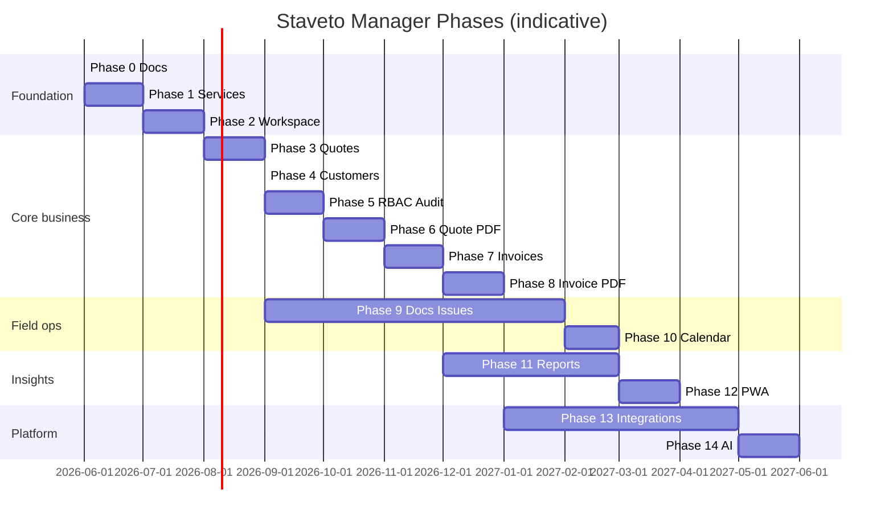

# Staveto Manager — Architecture

**Document purpose:** Target architecture and phased roadmap for evolving `staveto-office` into **Staveto Manager** — the web control plane for construction businesses using Staveto mobile in the field.  
**Last reviewed:** 2026-06-02  
**Evidence baseline:** Current repo is Next.js MVP only; mobile repo not in workspace.

---

## Evidence tags

| Tag | Meaning |
|-----|---------|
| **Verified** | Present in `staveto-office` today. |
| **Inferred** | Expected from mobile/Firebase conventions; not inspectable here. |
| **Planned** | Target design for Manager. |
| **Blocked** | Requires external spec, mobile repo, or infra not in workspace. |

---

## Product vision

**Staveto Manager** is the browser-based hub for owners, managers, and back-office staff: projects, financial documents (quotes, invoices), team administration, reporting, and integrations. **Staveto mobile** remains the primary capture surface for craftspeople on site (photos, quick expenses, task completion).

**Product & UX standards (permanent):** See [`staveto-manager-product-ux-standards.md`](./staveto-manager-product-ux-standards.md). Cursor rule: `.cursor/rules/staveto-manager-product-ux.mdc` (`alwaysApply: true`).

Design tenets:

1. **One Firebase project, one truth** — Web and mobile read/write the same Firestore collections where possible; no forked schemas.
2. **Mobile-safe evolution** — Additive fields only; dual-read during transitions; no big-bang migration to a new top-level `workspaces` collection that invalidates mobile queries.
3. **Services own Firestore** — UI and API routes call typed service modules; no ad-hoc `getDocs` in components.
4. **RBAC everywhere** — Authorization checks in services + Firestore rules; UI hides actions user cannot perform.
5. **AI with guardrails** — Agent may propose actions; **user confirmation** required before sensitive mutations (send invoice, delete data, change roles, billing).
6. **Gradual workspace identity** — Bridge through existing `organizations` (team) and `ownerId` (personal); introduce `workspaceId` / `workspaceType` on documents incrementally.

Target domain: **app.staveto.com** (or successor) serving Manager UI. **Verified** in README; rebranding **Planned**.

---

## Current state (staveto-office MVP)



| Layer | Today | Tag |
|-------|-------|-----|
| Routing | `(app)` shell with sidebar; public auth/join | **Verified** |
| State | React context for auth + workspace | **Verified** |
| Firestore access | Directly in `src/lib/*.ts` from client components | **Verified** |
| Quotes | In-memory estimates API | **Verified** |
| Organizations | Full CRUD for members/invites | **Verified** |
| Projects/tasks/expenses | Firestore aligned with mobile comment | **Verified** |
| Callable | `getBillingStatus` | **Verified** |
| Service layer | Absent | **Verified** |
| Audit / AI / PWA | Absent | **Verified** |

---

## Target architecture



### Layer responsibilities

| Layer | Responsibility | Must not |
|-------|----------------|----------|
| **UI** (`src/app`, `src/components`) | Presentation, forms, optimistic UX | Import Firestore SDK directly |
| **Hooks / context** | Session, active workspace, locale | Encode business rules |
| **Services** (`src/services`) | Queries, mutations, RBAC checks, DTO mapping | Render React |
| **Server routes** | PDF generation, webhooks, secrets | Expose raw Firestore to client |
| **Cloud Functions** | Billing, heavy PDF, integration sync, audit writers | Break mobile contracts |
| **Firestore rules** | Enforce org membership + roles | Rely on client-only checks |

---

## Folder structure (target)

Evolves from current flat `src/lib` without breaking imports overnight.

```
staveto-office/   # rename to staveto-manager Planned
├── docs/
│   ├── staveto-manager-feature-inventory.md
│   ├── staveto-manager-architecture.md
│   └── FIRESTORE_RULES_NOTES.md
├── public/
│   ├── manifest.webmanifest          Planned
│   └── icons/                      Planned
├── src/
│   ├── app/
│   │   ├── (auth)/                 login, register, join
│   │   ├── (app)/                  shell: dashboard, modules
│   │   │   ├── app/                projects, members, quotes, ...
│   │   │   ├── onboarding/
│   │   │   └── layout.tsx
│   │   └── api/
│   │       ├── quotes/             Planned Firestore-backed
│   │       ├── invoices/
│   │       ├── pdf/
│   │       └── webhooks/
│   ├── components/
│   │   ├── layout/
│   │   ├── modules/                feature-specific UI Planned
│   │   └── ui/
│   ├── context/
│   │   ├── AuthContext.tsx         Verified
│   │   └── WorkspaceContext.tsx    Verified
│   ├── services/                   Planned — sole Firestore writers/readers
│   │   ├── auth.service.ts
│   │   ├── workspace.service.ts
│   │   ├── project.service.ts
│   │   ├── task.service.ts
│   │   ├── expense.service.ts
│   │   ├── quote.service.ts
│   │   ├── invoice.service.ts
│   │   ├── customer.service.ts
│   │   ├── calendar.service.ts
│   │   ├── document.service.ts
│   │   ├── issue.service.ts
│   │   ├── team.service.ts
│   │   ├── report.service.ts
│   │   ├── audit.service.ts
│   │   ├── integration.service.ts
│   │   └── ai.service.ts
│   ├── lib/
│   │   ├── firebase.ts             client init only Verified
│   │   ├── workspace-types.ts
│   │   ├── rbac.ts                 Planned
│   │   └── types/                  shared DTOs
│   └── i18n/
└── functions/                      optional colocated; today external Verified
```

**Migration tactic:** Move `projects.ts` → `project.service.ts` re-export from `lib` until call sites updated. **Planned**

---

## Service layer

### Principles

1. **Single entry** for each collection path — e.g. `QuoteService.listForWorkspace(workspace, uid)`.
2. **RBAC inside service** — call `assertCan(uid, action, resource)` before writes.
3. **Indexed queries only** — throw `FirestoreIndexError` (pattern **Verified** in `projects.ts`).
4. **No schema breaks** — use optional fields; never rename mobile-required keys without dual-write period.
5. **Server vs client** — sensitive reads via Server Components + Admin SDK only if rules insufficient; default client SDK + rules for MVP parity with mobile.

### Example service API (illustrative)

```typescript
// Planned — not implemented
export class ProjectService {
  static list(workspace: Workspace, uid: string): Promise<ProjectDTO[]>;
  static getById(projectId: string, uid: string): Promise<ProjectDTO>;
  static create(workspace: Workspace, uid: string, input: CreateProjectInput): Promise<string>;
  static assertAccess(projectId: string, uid: string): Promise<ProjectDTO>;
}
```

Legacy `src/lib/projects.ts` becomes thin re-exports until removed. **Planned**

---

## Routes (target map)

| Route | Module | MVP | Manager |
|-------|--------|-----|---------|
| `/login`, `/register` | Auth | ✅ | ✅ |
| `/join` | Team | ✅ | ✅ |
| `/onboarding` | Onboarding | ✅ | ✅ shorten for mobile users Planned |
| `/app` | Dashboard | 🟡 | KPI dashboard Planned |
| `/app/projects` | Projects | ✅ | ✅ + filters |
| `/app/projects/[id]` | Projects/Tasks/Expenses | ✅ | + issues tab Planned |
| `/app/quotes` | Quotes | stub | ✅ Firestore |
| `/app/quotes/[id]` | Quotes | — | ✅ Planned |
| `/app/invoices` | Invoices | — | Planned |
| `/app/customers` | Customers | — | Planned |
| `/app/calendar` | Calendar | — | Planned |
| `/app/attendance` | Attendance | — | Planned |
| `/app/documents` | Documents | — | Planned |
| `/app/issues` | Issues | — | Planned |
| `/app/reports` | Reports | — | Planned |
| `/app/members` | Team | ✅ | ✅ + RBAC matrix Planned |
| `/app/billing` | Billing | ✅ | ✅ |
| `/app/settings` | Settings | stub | ✅ Planned |
| `/app/integrations` | Integrations | — | Planned |
| `/app/audit` | Audit | — | admin only Planned |
| `/estimates/*` | Legacy | ✅ | deprecate → redirect Planned |

Sidebar should link `/app/quotes` and hide `/estimates` after migration. **Planned**

---

## Firestore strategy

### Collections (known + planned)

| Collection | Purpose | Mobile | Web MVP |
|------------|---------|--------|---------|
| `users/{uid}` | Profile, onboarding | **Inferred** | **Verified** |
| `organizations/{orgId}` | Team workspace bridge | **Inferred** | **Verified** |
| `organizations/{orgId}/members/{uid}` | RBAC | **Inferred** | **Verified** |
| `invites/{id}` | Email invites | **Inferred** | **Verified** |
| `projects/{id}` | Projects | **Verified** comment | **Verified** |
| `projects/{id}/tasks/{id}` | Tasks | **Verified** | **Verified** |
| `projects/{id}/expenses/{id}` | Expenses | **Verified** | **Verified** |
| `quotes/{id}` | Quotes | **Inferred** | **Planned** |
| `invoices/{id}` | Invoices | **Inferred** | **Planned** |
| `customers/{id}` | CRM | **Inferred** | **Planned** |
| `calendarEvents/{id}` | Calendar | **Inferred** | **Planned** |
| `attendance/{id}` | Time tracking | **Inferred** | **Planned** |
| `documents/{id}` | Metadata | **Inferred** | **Planned** |
| `issues/{id}` | Defects | **Inferred** | **Planned** |
| `auditLogs/{id}` | Audit trail | — | **Planned** |
| `integrations/{orgId}` | OAuth tokens | — | **Planned** |

### Query patterns (indexed)

Documented in `FIRESTORE_RULES_NOTES.md` (**Verified**):

- Personal projects: `ownerId` + `orderBy(updatedAt desc)`
- Team projects: `orgId` + `orderBy(updatedAt desc)`
- Tasks: `orderBy(createdAt desc)` under project
- Expenses: `orderBy(date desc)` under project

New modules must add composite indexes before shipping UI. **Planned** CI check for index links in errors.

### Storage layout (planned)

```
/organizations/{orgId}/projects/{projectId}/documents/{fileId}
```

Signed URLs via Functions; metadata in `documents` collection. **Planned**

---

## Workspace migration (critical)

**Do not** big-bang migrate all data to a new `workspaces` collection or rename `organizations` in a way mobile cannot read.

### Bridge model (current → target)

| Concept | Personal | Team |
|---------|----------|------|
| UI workspace id | `"personal"` (synthetic) | `organizations/{orgId}` |
| Project filter field | `ownerId == uid` | `orgId == orgId` |
| New project fields | `workspaceType: "personal"`, `workspaceId: uid` | `workspaceType: "team"`, `workspaceId: orgId` |

**Verified** in `createProject` (`src/lib/projects.ts`).

### Gradual `workspaceId` rollout



| Phase | Web behavior | Mobile impact |
|-------|--------------|---------------|
| A | Continue `ownerId` / `orgId` queries | None **Verified** today |
| B | All **new** projects get `workspaceId` | None if field optional **Planned** |
| C | Lazy backfill on edit; nightly batch for hot projects | None if mobile ignores unknown fields |
| D | Services dual-query: `orgId` OR `workspaceId` during transition | Requires mobile release **Blocked** until coordinated |
| E | Deprecate `orgId`-only queries on web | Mobile must ship first **Inferred** |

**Forbidden:** Mass delete/recreate projects under new collection paths. **Planned** policy.

### Organization as workspace

`WorkspaceContext` already maps team workspaces to org ids (**Verified**). Long-term, `WorkspaceService.resolve(uid)` returns personal + org list without scanning all organizations — use `collectionGroup('members')` query **Planned** to replace O(n) org scan in `getUserOrgMemberships`.

---

## Plans, billing, and workspace programs

**Corrected product model** (aligned with mobile — see [`mobile-source-of-truth-analysis.md`](./mobile-source-of-truth-analysis.md) §4.1):

| Program | Meaning | Billing ownership | Web role |
|---------|---------|-------------------|----------|
| **Free** | Free personal plan | — | Show limits; default tier |
| **Solo** | **Paid** individual plan | **Apple App Store / Google Play** via mobile **RevenueCat** (entitlement `pro`, capability `personal_pro`) | **Read-only** status; no web IAP checkout |
| **Business** | Paid company/team | B2B org registration / `businessOrders` / server activation (`planCode`, `businessEnabled`) | Company workspace; separate from Solo |

**Mapping for implementation:**

```text
Free     →  PlanType free
Solo     →  PlanType personal_pro  (+ getBillingStatus / users.subscription)
Business →  PlanType business      (+ organizations.planCode when org active)
```

**Rules:**

- **Solo is not Business** — Solo unlocks personal Pro capabilities; Business unlocks organization workspace and team features when org licence is active.
- **Solo is not “onboarding only”** — onboarding “personal vs company” is a **usage path**; billing tier is independent.
- Web uses user-facing labels **Free / Solo / Business**; mobile subscription screens may still say **Staveto Pro** for Solo.
- Callable **`getBillingStatus`** (**Verified**) and Firestore profile fields are the web read path for personal entitlement — do not duplicate RevenueCat in the browser.
- Do not block personal job management when the user has Solo; do not require Business for personal workspace.

---

## Permissions (RBAC)

### Current roles (**Verified**)

| Role | Scope | Capabilities in MVP |
|------|-------|---------------------|
| `admin` | `organizations/{orgId}` | Members, billing sidebar, invite, role change |
| `member` | same org | Projects (team), no billing/members UI |

Personal workspace treats user as implicit owner; no `members` subcollection.

### Target permission matrix (**Planned**)

| Action | Personal owner | Team admin | Team member | Accountant (role) |
|--------|----------------|------------|-------------|-------------------|
| Read projects | ✅ | ✅ | ✅ | ✅ read-only |
| Create project | ✅ | ✅ | ✅ | ❌ |
| Delete project | ✅ | ✅ | ❌ | ❌ |
| Manage members | — | ✅ | ❌ | ❌ |
| Send quote / invoice | ✅ | ✅ | 🟡 configurable | ❌ |
| View billing | ✅ personal | ✅ | ❌ | ❌ |
| View audit log | — | ✅ | ❌ | ✅ read |
| AI execute sensitive action | confirm | confirm | confirm + deny list | deny |

Implementation:

1. `src/lib/rbac.ts` — pure functions `can(user, action, resource)`.
2. Services call `assertCan` before mutations.
3. Firestore rules mirror org membership + role (**draft** in `FIRESTORE_RULES_NOTES.md`).

---

## Audit logs

**Planned** append-only collection:

```typescript
interface AuditLogEntry {
  id: string;
  timestamp: Timestamp;
  actorUid: string;
  workspaceId: string;
  workspaceType: "personal" | "team";
  action: string;       // e.g. "quote.sent", "member.removed"
  entityType: string;
  entityId: string;
  metadata?: Record<string, unknown>;  // no PII dumps
  client: "web" | "mobile" | "function";
}
```

Writes via Cloud Function triggers on sensitive collections (**Planned**) to prevent client forgery. Web UI: `/app/audit` filtered by date and actor, admin-only.

---

## AI agent

### Scope (**Planned**)

- **Read:** Summarize project status, draft quote line items from notes, suggest expense category.
- **Write (confirmed):** Apply draft quote, update task status, create calendar hold — only after explicit user confirm dialog with diff preview.

### Architecture



**Sensitive actions** (require confirmation + audit):

- Send quote / invoice to customer
- Delete project, quote, invoice, document
- Change member role or remove member
- Billing / subscription changes
- Integration connect/disconnect

**Non-sensitive** (may auto-apply with undo):

- Draft quote edits not yet sent
- Expense category suggestion
- Internal task notes

Mobile must not be broken by AI-written fields — use same service validators as human writes. **Planned**

---

## Integrations

| Integration | Direction | Implementation |
|-------------|-----------|----------------|
| Google Calendar | Export/import events | OAuth via Function; store refresh token encrypted **Planned** |
| Accounting export | CSV / API | Batch export Function **Planned** |
| Email (quote/invoice) | Outbound | SendGrid/Resend from Function on confirm **Planned** |
| Webhooks | Inbound | `/api/webhooks/*` verify signature **Planned** |

Secrets never in Next.js client bundle. **Planned**

---

## Calendar

- **Data:** `calendarEvents` with `workspaceId`, optional `projectId`, `taskId`, attendees[].
- **UI:** Month/week agenda under `/app/calendar`; drag-drop **Planned** Phase 8+.
- **Sync:** Read-only Google import first; two-way later **Planned**.
- **Mobile:** Shared events collection **Inferred**; web must not use conflicting field names.

---

## Quote PDF

| Step | Owner |
|------|-------|
| Template HTML + CSS (SK/EU) | Shared package or Function **Planned** |
| Render PDF | Cloud Function (Puppeteer/pdfkit) **Planned** |
| Store | Firebase Storage `quotes/{id}/pdf.pdf` **Planned** |
| Download | Signed URL from Manager UI **Planned** |

Trigger: user clicks “Download PDF” or “Send” (send requires **AI/RBAC confirm**). Mobile may call same Function for identical output **Planned**.

---

## Invoice PDF

Same pipeline as quote PDF with invoice template and legal identifiers (IČO, DIČ, bank account). Numbering sequence in Firestore `organizations/{orgId}/counters/invoices` **Planned** — use transaction in Function to avoid duplicate numbers mobile/web race.

---

## PWA

| Item | Plan |
|------|------|
| `manifest.webmanifest` | name, icons, `display: standalone` **Planned** |
| Service worker | Cache app shell; network-first for API **Planned** |
| Offline | Read-only cached project list + last opened project **Planned** |
| Install prompt | Optional banner on mobile browsers **Planned** |
| Push | Defer; mobile handles push **Inferred** |

Do not cache Firestore writes offline without conflict resolution — read-only offline Phase 12+. **Planned**

---

## Phased roadmap (Phases 0–14)

### Phase 0 — Baseline documentation & guardrails

**Status:** In progress (this document).  
**Deliverables:** Feature inventory, architecture, FIRESTORE_RULES_NOTES maintained.  
**Rules:** No schema breaks; mobile-safe commits.  
**Tag:** **Verified** docs; **Planned** enforcement in PR template.

### Phase 1 — Service layer extraction

- Introduce `src/services/*`; migrate `projects`, `organizations`, `userProfile`.
- ESLint rule: ban `getFirestore` import outside `services/` and `lib/firebase.ts`. **Planned**
- Zero user-visible change.

### Phase 2 — Workspace hardening

- Fix `getUserOrgMemberships` O(n) with `collectionGroup('members')` **Planned**
- Ensure all new projects set `workspaceId` / `workspaceType` **Verified** for create path
- Lazy backfill utility (admin-only script via Function) **Planned**
- **No** `workspaces` collection migration

### Phase 3 — Quotes on Firestore

- Implement `quote.service.ts` matching mobile schema (**Blocked** until schema confirmed)
- Replace in-memory `estimatesStore`; redirect `/estimates` → `/app/quotes`
- Workspace-scoped list queries + indexes

### Phase 4 — Customers

- CRUD customers; link from quote/invoice forms
- Dedupe by email/company **Planned**

### Phase 5 — RBAC v2 & audit

- `rbac.ts` + expanded roles (accountant)
- `auditLogs` + Function triggers
- `/app/audit` admin viewer

### Phase 6 — Quote PDF

- PDF Function + Storage
- UI download + email send with confirm

### Phase 7 — Invoices

- Invoice CRUD from quote
- Numbering + tax lines
- Status: draft → sent → paid

### Phase 8 — Invoice PDF & email

- Shared PDF infra with quotes
- Send invoice confirmation flow

### Phase 9 — Documents & Issues

- Storage upload component
- Issues module linked to projects

### Phase 10 — Calendar & attendance

- Calendar UI + events collection
- Attendance timesheets (read mobile shape first)

### Phase 11 — Reports & dashboard

- Manager dashboard KPIs
- Export CSV; project P&L

### Phase 12 — PWA

- manifest + service worker
- Read-only offline

### Phase 13 — Integrations

- Calendar OAuth
- Accounting export
- Webhook endpoints

### Phase 14 — AI agent

- Proposal + confirm UX
- Tool restrictions per RBAC
- Audit all executed actions



Timelines are **Planned** placeholders, not commitments.

---

## Cross-cutting concerns

### Internationalization

Continue `translations.ts` pattern; module strings namespaced `quotes.*`, `invoices.*`. **Verified** pattern.

### Error handling

Keep `FirestoreIndexError` UX with link to Firebase console index creation. **Verified**

### Testing

- Service unit tests with Firestore emulator **Planned**
- E2E critical paths: auth, create project, quote **Planned**

### Security

- Harden rules per `FIRESTORE_RULES_NOTES.md` before Phase 3 **Planned**
- CSP headers on Vercel **Planned**
- Callable functions validate `request.auth` **Inferred**

### Observability

- Structured logs in Functions; client error boundary **Planned**
- No PII in logs

---

## Decision log

| ID | Decision | Rationale | Tag |
|----|----------|-----------|-----|
| D1 | Bridge workspaces via `organizations`, not new collection | Mobile-safe | **Planned** |
| D2 | Gradual `workspaceId` backfill | Avoid big-bang | **Planned** |
| D3 | Services-only Firestore | Testability + RBAC | **Planned** |
| D4 | Deprecate in-memory estimates | Single source of truth | **Planned** |
| D5 | AI confirm for sensitive writes | Safety | **Planned** |
| D6 | PDF via Cloud Functions | Consistent mobile/web output | **Planned** |
| D7 | Keep Firebase project `staveto-mvp-5f251` | README **Verified** |

---

## Open dependencies (blocked)

1. Mobile Firestore schema export for quotes, invoices, customers. **Blocked**
2. Production Firestore rules ownership and deployment pipeline. **Blocked**
3. Billing product rules (per-user vs per-org). **Blocked**
4. Legal PDF requirements per country (SK/CZ). **Blocked**

---

## Related documents

- [staveto-manager-feature-inventory.md](./staveto-manager-feature-inventory.md)
- [FIRESTORE_RULES_NOTES.md](./FIRESTORE_RULES_NOTES.md)

---

## Phase 1 implementation note (2026-06-02)

### Implemented

- **`src/types/workspace.ts`** — `ActiveWorkspace`, `WorkspaceType` (`personal` | `company`), `WorkspaceRole`, `WorkspaceMember`, `WorkspaceSource`.
- **`src/services/workspace/workspaceService.ts`** — load personal + organization workspaces, `resolveActiveWorkspace`, `getProjectWorkspaceWriteFields` (adds `source: "web"` on create), session persistence for active workspace id.
- **`src/context/WorkspaceContext.tsx`** — delegates loading to workspace service; exposes `activeWorkspace`, `availableWorkspaces`, `legacyActiveWorkspace`, `workspaceRole`, legacy `memberRole` / `workspaces` for existing UI.
- **`src/lib/workspace-types.ts`** — legacy `Workspace` (`personal` | `team`) + `toLegacyWorkspace` / `fromLegacyWorkspace` bridge.
- **`src/permissions/roles.ts`** — `can(role, action)` matrix; maps org `admin` → `admin`, `member` → `manager`, personal → `owner`.
- **`src/services/audit/auditService.ts`** — `buildAuditEvent` / `logAuditEvent` (prepare only; no Firestore writes in Phase 1).
- **Project create** — still writes `ownerId` / `orgId` and `workspaceType` `personal` | `team`; additionally `source: "web"` and normalized `workspaceId`.

### Intentionally not changed

- No data migration; top-level `projects` and `organizations` unchanged.
- No `workspaces/{workspaceId}` collection reads or writes.
- `organizations` collection name and member documents unchanged.
- `listProjectsForWorkspace` queries still use `ownerId` / `orgId` via legacy workspace shape.
- No global permission enforcement on routes or mutations.
- No audit log persistence to Firestore yet.

### Compatibility

- Mobile apps continue to read `ownerId`, `orgId`, `workspaceType: "team"`, `workspaceId`.
- Web UI switcher still uses legacy `Workspace` list in the header (`workspaces` alias).
- Company workspaces use normalized `type: "company"` in context; UI checks use `isCompanyWorkspaceType()` (`company` or legacy `team`).

### Tenant subdomains (2026-06-02)

- Slug utilities, organization slug service, `tenantResolver`, `WorkspaceContext` tenant mode, settings UI, [staveto-subdomains.md](./staveto-subdomains.md).
- No DNS/Vercel changes in code; optional org fields only.

### Next recommended step (Phase 2 — after approval)

- Enforce `can()` on sensitive UI actions (members invite, billing, project delete).
- Deploy Firestore `auditLogs` subcollection rules under `organizations/{orgId}/auditLogs`.
- Wire `logAuditEvent` after project create and workspace switch.
- Optional: export `usePermission(action)` hook.

---

## Document history

| Date | Change |
|------|--------|
| 2026-06-02 | Phase 1 workspace foundation (bridge layer) |
| 2026-06-02 | Initial architecture from `staveto-office` MVP analysis |
