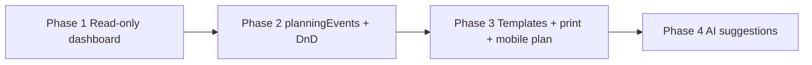

# Staveto Manager — Planning Module Proposal

**Document purpose:** Product vision, UX architecture, and phased implementation plan for the **Planning** module in Staveto Manager Web (`staveto-office`).  
**Status:** Phase 1 **implemented** (read-only dashboard) — `planningEvents`, drag-and-drop, and schema changes remain **future work**.  
**Last reviewed:** 2026-06-02  
**Related:** [`mobile-source-of-truth-analysis.md`](./mobile-source-of-truth-analysis.md), [`staveto-manager-product-ux-standards.md`](./staveto-manager-product-ux-standards.md), [`staveto-manager-architecture.md`](./staveto-manager-architecture.md), [`web-alignment-plan-from-mobile.md`](./web-alignment-plan-from-mobile.md)

---

## Evidence tags

| Tag | Meaning |
|-----|---------|
| **Verified** | Exists in mobile or web repo today (read path or type). |
| **Inferred** | Expected mobile/Firestore shape; not fully wired on web. |
| **Proposed** | Future design in this document. |
| **Blocked** | Requires mobile contract sign-off or schema approval. |

---

## 1. Product vision

**Planning** is the operational command center for construction company managers — not a generic calendar, but a **resource-aware planning board** that answers “who, where, when, with what” in seconds.

Staveto mobile captures **reality on site** (attendance, time entries, absences, task progress). Staveto Manager Planning shows **intent vs reality**: what was planned, who is actually working, who is absent, which jobs are at risk, and where people or machines are double-booked.

**North star:** A site manager opens Planning before coffee and immediately knows today’s crew layout, gaps, delays, and what needs a phone call — without digging through five screens.

**Design bar:** Best-in-class visual clarity comparable to modern resource scheduling tools (TeamGantt resource view, Float, Raken crew board, Procore schedule overlays) — but **construction-native**: jobs, crews, machines, absences, and Slovak/EU workflows first.

**Primary view:** **Resource Timeline / Planning Board** (rows = people, teams, machines; columns = days/week).

---

## 2. User problems

| Problem | Today (mobile + web) | Planning module solves |
|---------|----------------------|-------------------------|
| “Kto dnes ide kde?” | Scattered across projects, tasks, attendance | Single **Today** briefing |
| Double-booking workers | No company-wide view | Conflict detection + workload bars |
| Absences invisible on job plan | HR/absences separate from jobs | **Absence overlay** on timeline |
| Planned vs actual unknown | `timeEntries` exist; no plan layer | Plan vs actual comparison (Phase 2+) |
| Machine conflicts | Fleet/machinery in mobile maintenance flows | **Machine/vehicle rows** on board |
| Job delays unclear | Task due dates per project only | Cross-job deadline + milestone view |
| Week planning on whiteboard | No web tool | Week planner + printable plan |
| New manager onboarding | Tribal knowledge | Visual board + filters by job/team |
| Field workers ask “kde idem?” | Mobile timer/project context | “My plan today” (mobile later) |

---

## 3. Manager questions this module must answer

Within **5 seconds** of opening Planning:

1. **Who is working today?** (assigned + checked in)
2. **Where are they?** (which job / site)
3. **Who is absent?** (vacation, sick leave, unplanned)
4. **Who should be somewhere but isn’t?** (missing attendance vs assignment)
5. **What jobs are active this week?** (color-coded)
6. **Which machines/vehicles are booked?** (conflicts?)
7. **What is overdue or due soon?** (tasks, milestones)
8. **Who is overloaded?** (>8h/day, multiple sites same day)
9. **What is unassigned?** (jobs/tasks needing crew)
10. **What changed since yesterday?** (briefing delta)

---

## 4. Recommended views (information architecture)

Planning becomes a **top-level sidebar section** (replacing current “Čoskoro” placeholder at `sidebar.item.jobs.planning`).

```
/app/planning                    → default: Today
/app/planning/week               → Resource timeline (primary)
/app/planning/month              → Month overview
/app/planning/jobs/[projectId]   → Job planning (deep link from project)
/app/planning/team               → Team workload
/app/planning/machines           → Asset booking board
```

**In-module tabs (MVP shell):** Today · Week · Month · Team  
**Secondary entry points:** Project detail → “Plánovanie zákazky”; Members → “Dostupnosť”.

---

## 5. Resource planning board (primary view)

### Layout

```
┌─────────────────────────────────────────────────────────────────────────┐
│  Plánovanie    [Dnes][Týždeň][Mesiac][Tím]     Filter: Job ▾ Team ▾   │
├─────────────────────────────────────────────────────────────────────────┤
│  ⚠ 2 chýbajúce dochádzky · 1 neobsadená zákazka · 1 konflikt stroja    │
├──────────┬──────┬──────┬──────┬──────┬──────┬──────┬──────┐
│ Zdroj    │ Po 3 │ Ut 4 │ St 5 │ Št 6 │ Pi 7 │ So 8 │ Ne 9 │
├──────────┼──────┼──────┼──────┼──────┼──────┼──────┼──────┤
│ 👤 Ján K │ ████ │ ████ │ ░░░░ │ ████ │      │      │      │  ← job color blocks
│ 👤 Peter │  🏖  │  🏖  │ ████ │ ████ │ ████ │      │      │  ← absence stripe
│ 👥 Tím A │ ████ │ ████ │ ████ │      │      │      │      │
│ 🚜 Bagr  │ ████ │      │ ████ │ ████ │      │      │      │
│ 🚐 Dodávka│     │ ████ │ ████ │      │      │      │      │
└──────────┴──────┴──────┴──────┴──────┴──────┴──────┴──────┘
```

### Row types (priority order)

| Row type | Source (MVP → later) |
|----------|----------------------|
| **Employees** | `organizations/{orgId}/members` + display names **Verified** |
| **Teams** | Proposed grouping (tags or `assignedTeamIds` later) |
| **Machines / vehicles** | Mobile maintenance/fleet **Inferred** → `planningEvents` **Proposed** |
| **Jobs (optional row mode)** | Flip axis: job rows, people in cells — for job-centric managers |

### Cell content

- **MVP:** inferred blocks from `projects.assignedMemberIds`, `tasks.assigneeId` + `dueDate`, `absences`, aggregated `timeEntries`
- **Phase 2:** explicit `planningEvents` blocks (planned work, bookings)

### Interactions (phased)

| Phase | Interaction |
|-------|-------------|
| MVP | Read-only, click → detail drawer |
| Phase 2 | Drag-create, drag-move, resize duration |
| Phase 3 | Copy week, templates, bulk assign |

---

## 6. Calendar views

### Month calendar (secondary)

- **Purpose:** absences, hard deadlines, milestones, deliveries, inspections — not hourly crew detail.
- **Density:** dot + count badges per day; expand day panel.
- **Not:** primary crew scheduling surface (too coarse).

### Week timeline (primary)

- Horizontal scroll; sticky resource column; sticky day headers.
- Zoom: day columns (MVP) → half-day slots (later).
- Weekend columns collapsible.

### Today (executive briefing)

- Card stack: **Na stavbe** · **Absentní** · **Chýba dochádzka** · **Termíny dnes** · **Varovania**
- Mini timeline for current day only.

---

## 7. Job planning view

**Route:** `/app/planning/jobs/[projectId]` or tab inside project detail.

Shows one job as a **horizontal timeline**:

| Lane | Content |
|------|---------|
| Crew | assigned members across date range |
| Tasks | `projects/{id}/tasks` with `dueDate`, `assigneeId` **Verified** |
| Milestones | sales/delivery phases **Proposed** |
| Machines | bookings linked to project **Proposed** |
| Actual | `timeEntries` sum per day **Inferred** |

**Actions (later):** Quick assign worker, quick book machine, add planned work block.

**MVP:** Read-only aggregation from existing project/task/member data.

---

## 8. Team planning view

Per-employee **workload strip**:

- Hours planned vs logged (week)
- Absence calendar strip
- Job allocation % (stacked bar by job color)
- **Overbooked** warning when > threshold (e.g. two full-day jobs same day)

Filters: role (worker/manager), team tag, active only.

**MVP:** Show assigned projects + task counts + absence flags; placeholder for planned hours until `planningEvents`.

---

## 9. Machine / equipment planning

Mobile already distinguishes maintenance archetypes (`FLEET`, `MACHINERY`, `EQUIPMENT`) **Verified** in work types.

Planning module adds **asset rows** on the resource board:

| Event type | Meaning |
|------------|---------|
| `machine_booking` | Excavator, lift, compressor on job X |
| `vehicle_booking` | Van, truck |
| `inspection` | STK, service window |

**MVP:** Placeholder row “Stroje a vozidlá” with empty state + link to future asset registry.  
**Phase 2:** `assignedAssetIds` on `planningEvents`; conflict if same asset double-booked.

**Future link:** `projects/{id}/equipment` subcollection **Inferred** on mobile.

---

## 10. Absence and sick leave overlay

**Mobile:** absences in business/HR module **Inferred** (exact path TBD — treat as org-scoped reads).

**UX:**

- Full-day absence = hatched background on employee row (`vacation`, `sick_leave`)
- Partial absence = half-cell pattern (later)
- Icon legend: 🏖 dovolenka · 🤒 PN · 📋 služobná cesta

**Rules:**

- Absence blocks assignment drag (Phase 2)
- Warning if manager assigns work on absent day (MVP: static warning badge)

**Colors:** neutral gray hatch — do not use job colors for absences (avoid confusion).

---

## 11. Attendance vs plan comparison

| Signal | Source | MVP display |
|--------|--------|-------------|
| **Planned** | assignments + future `planningEvents` | Inferred from project membership / tasks |
| **Actual** | `timeEntries`, `users/{uid}.activeTimer` **Inferred** | “Logged 6.5h on Job X” |
| **Gap** | planned site ≠ timer project | Amber “Na inom mieste” |
| **Missing** | no entry by expected start | Red “Chýba dochádzka” |

**Today briefing** highlights gaps first — highest manager value with existing mobile data.

**Phase 2:** Side-by-side bar (planned hours | actual hours) per person per day.

---

## 12. Task / deadline integration

**Verified web types:** `TaskDoc.dueDate`, `assigneeId`, `assigneeName` in `src/lib/projects.ts`.

**Planning treatment:**

| Item | Visual |
|------|--------|
| Task due today | Diamond marker on assignee row |
| Overdue task | Red pulse on job color |
| Milestone | Flag icon on job timeline |
| Unassigned task with due date | “Neobsadené úlohy” queue |

**Do not duplicate task editing** in Planning — click opens task/project detail.

**Later:** `planningEvents` with `type: task_deadline` synced from task or manual milestone.

---

## 13. Best-in-class features (benchmark)

Inspired by Float, Raken, Procore, TeamGantt, Deputy, Clockify resource planner:

| Feature | Staveto priority |
|---------|------------------|
| Resource timeline (people × time) | **P0** |
| Drag-and-drop scheduling | Phase 2 |
| Conflict / double-booking detection | Phase 2 |
| Absence overlay | MVP (read) |
| Plan vs actual | MVP partial → Phase 2 full |
| Copy previous week | Phase 3 |
| Schedule templates (repeat crews) | Phase 3 |
| Unassigned work queue | MVP list → Phase 2 drag |
| Printable weekly PDF | Phase 2 |
| Filters (job, team, role, site) | MVP |
| Color by job | MVP |
| Manager daily briefing | MVP (Today) |
| Worker “My plan today” mobile | Phase 3 mobile |
| Weather / travel time | Phase 4 optional |
| AI draft week plan | Phase 4 (confirm only) |

---

## 14. Data model proposal (not implemented)

### Option A — Organization-scoped (recommended)

```
organizations/{orgId}/planningEvents/{eventId}
```

**Pros:** Company-wide resource board, one query for week view, aligns with `organizations/{orgId}/members`, absences, business context.  
**Cons:** Must index by date range + assignees; job detail needs `projectId` filter.

### Option B — Project subcollection

```
projects/{projectId}/planningEvents/{eventId}
```

**Pros:** Natural job detail embedding.  
**Cons:** N queries for company week view; poor resource timeline performance; cross-job conflicts hard.

### Recommendation

**Option A** as system of record for Business planning.  
Optional **denormalized** `projectId` on every event for job view queries.  
Job detail may **cache** summary counts on `projects/{id}.planningSummary` later (additive, optional).

### Proposed document shape

```typescript
// Proposed — organizations/{orgId}/planningEvents/{eventId}
{
  id: string;
  orgId: string;
  projectId?: string | null;      // primary job link
  title: string;
  type:
    | "planned_work"
    | "absence" | "vacation" | "sick_leave"
    | "inspection" | "delivery"
    | "machine_booking" | "vehicle_booking"
    | "task_deadline" | "milestone" | "meeting";
  start: Timestamp;               // or ISO string — match mobile convention at approval
  end: Timestamp;
  allDay: boolean;
  assignedUserIds: string[];
  assignedTeamIds?: string[];     // future
  assignedAssetIds?: string[];  // future asset registry ids
  taskId?: string | null;
  status: "planned" | "confirmed" | "in_progress" | "completed" | "cancelled";
  color?: string | null;        // override; default from project palette
  notes?: string | null;
  createdBy: string;
  createdAt: Timestamp;
  updatedAt: Timestamp;
  source: "web" | "mobile" | "system";
  linkedTimeEntryIds?: string[]; // Phase 2+ reconciliation
}
```

### Indexes (future)

- `(orgId, start ASC)` — week range
- `(orgId, assignedUserIds array-contains, start)` — person row
- `(orgId, projectId, start)` — job view
- `(orgId, type, start)` — absence overlay

### Existing data used in MVP (no new collection)

| Data | Path / field | Tag |
|------|----------------|-----|
| Projects | `projects` where `orgId` | **Verified** |
| Project members | `projects/{id}/members` or `assignedMemberIds` **Inferred** | |
| Tasks | `projects/{id}/tasks` (`dueDate`, `assigneeId`) | **Verified** types |
| Org members | `organizations/{orgId}/members` | **Verified** |
| Time entries | `timeEntries` or project-scoped **Inferred** | |
| Active timer | `users/{uid}.activeTimer` **Inferred** | |
| Absences | org or user scoped **Inferred** | |

**Mobile compatibility:** `planningEvents` is **additive**. Mobile ignores until native support. No changes to `timeEntries`, `absences`, or timer shape required for Phase 1.

---

## 15. Mobile compatibility

| Rule | Detail |
|------|--------|
| Read-only first | Web Planning reads mobile-written data; no new writes in MVP |
| Additive schema | `planningEvents` optional on mobile |
| Timer safety | Never stop/start timers from Planning without explicit mobile UX parity |
| Worker view | Future mobile screen “Môj plán dnes” reads same `planningEvents` + assignments |
| Offline | Mobile offline rules out of scope for web MVP |
| Roles | Respect `owner/admin/manager/worker/viewer` — workers see own plan only on mobile |

---

## 16. MVP scope

### Phase 1 — Read-only planning dashboard (web only)

**Route:** `/app/planning`  
**Sidebar:** Enable Planning nav (remove `comingSoon`)

| Deliverable | Detail |
|-------------|--------|
| Premium shell | Staveto brand (`#1D376A`, `#e06737`), sticky filters, empty states |
| Tabs | Today · Week · Month · Team |
| Data | Existing Firestore only — projects, tasks, members, absences, timeEntries (as available) |
| Today | Briefing cards + gaps |
| Week | Resource timeline **read-only** with inferred blocks |
| Month | Deadlines + absences dots |
| Team | Workload summary |
| Placeholders | “Plánované bloky” empty state explaining Phase 2 |
| **Excluded** | drag/drop, `planningEvents`, FullCalendar dependency, AI, PDF export |

**Success metric:** Manager answers “who works where today” in <10s using real data.

### Phase 2 — Planned events + editing

| Deliverable | Detail |
|-------------|--------|
| Firestore | `organizations/{orgId}/planningEvents` + rules + indexes |
| CRUD | Create planned work, assign workers/assets |
| DnD | Move/resize blocks on week board |
| Conflicts | Double-booking warnings |
| Job/Machine views | Full asset rows |

### Phase 3 — Productivity

| Deliverable | Detail |
|-------------|--------|
| Copy week, templates | Repeat crew patterns |
| Printable weekly plan | PDF/browser print |
| Plan vs actual bars | timeEntries reconciliation |
| Mobile “My plan today” | Read path in mobile app |

### Phase 4 — Intelligence (optional)

| Deliverable | Detail |
|-------------|--------|
| AI draft week | Suggest assignments; **confirm before save** |
| Overload detection | Proactive suggestions |
| Weather / travel | Context cards (non-blocking) |

---

## 17. Later phases (summary)



Additional later modules feeding Planning:

- Materials/delivery windows on timeline
- Customer-facing milestone dates from quotes
- Subcontractor crew rows (external resources)
- Integration with invoice/milestone billing dates

---

## 18. UI/UX principles

1. **Clarity over density** — max 8–12 visible rows; paginate/virtualize rest.
2. **Color = job** — consistent palette per `projectId`; absences never use job colors.
3. **Icons supplement color** — absence, machine, deadline (WCAG: not color-only).
4. **Filters persist** — sessionStorage per manager (`jobId`, `team`, date range).
5. **Progressive disclosure** — Today simple; Week full board; advanced in drawers.
6. **Click → context** — drawer with job, person, task links; no modal maze.
7. **Premium SaaS** — subtle shadows, rounded cards, smooth scroll, skeleton loading.
8. **Slovak first** — i18n keys `planning.*`; DE/EN secondary.
9. **Empty states teach** — “Zatiaľ plánujete v hlave? Od fázy 2 pridáte bloky priamo tu.”
10. **Performance** — week query bounded; virtualized grid; no full org history load.
11. **Confirm destructive changes** — per product UX standards.
12. **No clutter** — hide zero-data rows toggle (“Skryť neobsadených”).

---

## 19. Risks

| Risk | Mitigation |
|------|------------|
| Mobile absence/timeEntry paths unknown on web | Phase 0 spike: document exact Firestore paths from mobile repo before MVP data wiring |
| Performance of week board | Server-side date-bounded queries; virtualization; limit 50 rows default |
| Schema fork | Single org-scoped `planningEvents`; mobile sign-off before Phase 2 write |
| Managers expect Google Calendar | Set expectation: resource board first; month is secondary |
| Over-engineering DnD early | Phase 1 read-only proves value |
| Firestore rules complexity | Planning writes = `canManageCompanyOperations`; read = org member |
| Stale assignments | Show “last updated” + link to project; Phase 2 status on events |
| Worker privacy | Workers see own row only on mobile; managers see all |
| AI trust | Draft only + confirm; never auto-move crews |

---

## 20. Implementation plan

### Step 0 — Discovery (before Phase 1 code)

1. **Mobile Firestore audit** — confirm paths for `timeEntries`, `absences`, `activeTimer`, project `assignedMemberIds`, absence types.
2. **Stakeholder sign-off** on this proposal + Option A schema sketch.
3. **Design mockups** — Week board + Today briefing (Figma or in-app static HTML canvas).
4. **Nav update plan** — `sidebarNavigation.ts`: `jobs-planning` → `/app/planning`, remove `comingSoon`.

### Step 1 — Phase 1 implementation (after approval)

| # | Task | Owner |
|---|------|-------|
| 1 | `planningService.ts` — read aggregators (projects, tasks, members) | Backend |
| 2 | `usePlanningWeek()` hook — date range state | Frontend |
| 3 | `/app/planning` layout + tabs | Frontend |
| 4 | `PlanningTodayView` — briefing cards | Frontend |
| 5 | `PlanningWeekBoard` — read-only grid component | Frontend |
| 6 | `PlanningMonthView` — deadline/absence dots | Frontend |
| 7 | `PlanningTeamView` — workload list | Frontend |
| 8 | i18n `planning.*` SK/EN/DE | Content |
| 9 | Firestore rules **read only** for inferred collections | Firebase |
| 10 | Empty/loading/error states | Frontend |

**Dependencies:** Working company workspace, org members list, projects with `orgId`, tasks subcollection readable.

### Step 2 — Phase 2 (schema approval gate)

| # | Task |
|---|------|
| 1 | Approve `planningEvents` schema with mobile team |
| 2 | Firestore rules + indexes |
| 3 | `planningEventService` CRUD |
| 4 | DnD library evaluation (custom grid vs `@dnd-kit` — **not** FullCalendar) |
| 5 | Conflict engine |
| 6 | Asset registry minimal model (if not existing) |

### Step 3 — Phase 3+

Templates, print, mobile read API, AI draft (callable + confirm UI).

---

## Appendix A — AI later (guardrails)

AI may **propose**:

- Weekly crew assignment draft
- “Who is available Tuesday?”
- Overload summary narrative
- Missing attendance explanation

AI must **not**:

- Write `planningEvents` without user confirmation
- Move or delete existing blocks silently
- Override approved absences

Pattern: same as quote AI — **draft → review → confirm save**.

---

## Appendix B — Navigation placement

Current sidebar (**Verified**): `Plánovanie` under Zákazky with `comingSoon: true`.

**Proposed:** Promote to primary section when Phase 1 ships:

```
Zákazky
  …
Plánovanie          → /app/planning     (NEW primary)
  Dnes
  Týždeň
  Mesiac
  Tím
```

Or top-level **Plánovanie** section parallel to Zákazky/Financie — product decision at mockup review.

---

## Appendix C — Summary for stakeholders

| Question | Answer |
|----------|--------|
| **Direction** | Resource Timeline / Planning Board as primary; not a simple calendar |
| **MVP** | Phase 1 read-only dashboard from existing mobile data |
| **Later** | `planningEvents`, drag-and-drop, conflicts, templates, AI drafts |
| **Data model** | `organizations/{orgId}/planningEvents/{eventId}` (Option A) — **proposed, not built** |
| **Dependencies** | Mobile path audit, schema approval, company workspace + projects/tasks/members readable |
| **Mobile** | Additive; no breaking changes |

---

*End of proposal — Phase 1 read-only dashboard shipped in web; Phase 2 awaits schema approval.*

---

## Appendix D — Phase 1 implementation note (2026-06-02)

| Item | Status |
|------|--------|
| Route | `/app/planning` — live |
| Navigation | Sidebar **Plánovanie** → `/app/planning` (no longer “Čoskoro”) |
| Mode | **Read-only** — no writes, no `planningEvents`, no drag-and-drop |
| Data | `organizations/{orgId}/members`, `projects` (incl. `assignedMemberIds`), `projects/{id}/tasks` (`dueDate`), best-effort read of `absences` / `timeEntries` (shows placeholder if Firestore rules deny) |
| Tabs | Dnes · Týždeň · Mesiac · Tím |
| Service | `src/services/planning/planningReadService.ts` |
| Components | `src/components/planning/*` |
| Not built | `planningEvents`, FullCalendar, DnD, AI planning, new collections, schema changes |
